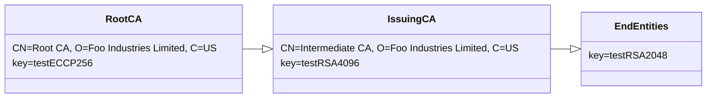

# S/MIME Baseline Requirements Sample Certificate Generator by jsrsasign

## Overview
This project provides generator for certificates and CRLs conforming to [CA/Browser Forum S/MIME Baseline Requirements](https://cabforum.org/smime-br/) inspired by [smbr-cert-factory](https://github.com/digicert/smbr-cert-factory) project.

Certificates and CRLs will be generated using pure JavaScript [jsrsasign](https://github.com/kjur/jsrsasign) PKI library.

## Requirements
Generator scripts requires [Node.JS](https://nodejs.org/) and `/bin/sh`.

## How to generate certificates and CRLs

Download the package from [here](https://github.com/kjur/smbr-cert-generator/archive/refs/heads/main.zip). Then run following:
```
% unzip smbr-cert-generator-main.zip
% cd smbr-cert-generator-main
% cd data
% npm install jsrsasign jsrsasign-util
% sh ./makecert.sh
```
You can see generated certificates and CRLs in [`../artifacts`](https://github.com/kjur/smbr-cert-generator/tree/main/artifacts) directory.

## Certificate and CRL Customization
All of certificate and CRL parameters are defined as JSON in data directory. So you can modify and add them such as validity period, names, mail addresses or extensions. Here is a [`data/mailbox-validated_strict.json`](https://github.com/kjur/smbr-cert-generator/blob/main/data/mailbox-validated_strict.json):

```JavaScript
{
  "version": 3,
  "serial": {"hex": "7b2c41983c7f8e0f82fc8fb7b1aedde23882ad4c"},
  "sigalg": "SHA256withRSA",
  "issuer": {
    "str": "/C=US/O=Foo Industries Limited/CN=Intermediate CA",
    "array": [
      [{"type": "C", "ds": "prn", "value": "US"}],
      [{"type": "O", "ds": "utf8", "value": "Foo Industries Limited"}],
      [{"type": "CN", "ds": "utf8", "value": "Intermediate CA"}]
    ]
  },
  "notbefore": "230419000000Z",
  "notafter": "230718235959Z",
  "subject": {
    "str": "/CN=hanako.yamada@example.com/E=hanako.yamada@example.com",
    "array": [
      [{"type": "CN", "ds": "utf8", "value": "hanako.yamada@example.com"}],
      [{"type": "E", "ds": "ia5", "value": "hanako.yamada@example.com"}]
    ]
  },
  "sbjpubkey": "testRSA2048.p8.pub",
  "ext": [
    {
      "extname": "basicConstraints",
      "critical": true
    },
    {
      "extname": "keyUsage",
      "critical": true,
      "names": ["digitalSignature"]
    },
    {
      "extname": "authorityKeyIdentifier",
      "kid": "testRSA4096.p8.pub"
    },
    {
      "extname": "subjectKeyIdentifier",
      "kid": "testRSA2048.p8.pub"
    },
    {
      "extname": "certificatePolicies",
      "array": [{"policyoid": "smimeMailboxStrict"}]
    },
    {
      "extname": "cRLDistributionPoints",
      "array": [
        {"dpname": {"full": [{"uri": "http://crl.ca.example.com/issuing_ca_crl.crl"}]}}
      ]
    },
    {
      "extname": "authorityInfoAccess",
      "array": [{"caissuer": "http://repository.ca.example.com/issuing_ca.der"}]
    },
    {
      "extname": "extKeyUsage",
      "array": ["emailProtection"]
    },
    {
      "extname": "subjectAltName",
      "array": [
        {"rfc822": "hanako.yamada@example.com"},
        {
          "other": {
            "oid": "smtpUTF8Mailbox",
            "value": {"utf8str": {"str": "山田花子@example.com"}}
          }
        }
      ]
    }
  ],
  "cakey": "testRSA4096.p5p.prv"
}
```

## Private and Public Keys
All of private key are defined in the [IETF Internet-Draft Standard PKC Test Keys](https://www.ietf.org/archive/id/draft-gutmann-testkeys-03.html) and their files are stored in `data` directory.

- [testECCP256.p5p.prv](https://github.com/kjur/smbr-cert-generator/blob/main/data/testECCP256.p5p.prv): PKCS#1 PEM EC P-256 curve private key (Root CA)
- [testECCP256.p8.pub](https://github.com/kjur/smbr-cert-generator/blob/main/data/testECCP256.p8.pub): PKCS#8 PEM EC P-256 curve public key
- [testRSA4096.p5p.prv](https://github.com/kjur/smbr-cert-generator/blob/main/data/testRSA4096.p5p.prv): PKCS#1 PEM RSA 4096bit private key (Intermediate CA)
- [testRSA4096.p8.pub](https://github.com/kjur/smbr-cert-generator/blob/main/data/testRSA4096.p8.pub): PKCS#8 PEM RSA 4096 public key
- [testRSA2048.p5p.prv](https://github.com/kjur/smbr-cert-generator/blob/main/data/testRSA2048.p5p.prv): PKCS#1 PEM RSA 2048bit private key (End Entity)
- [testRSA2048.p8.pub](https://github.com/kjur/smbr-cert-generator/blob/main/data/testRSA2048.p8.pub): PKCS#8 PEM RSA 2048bit public key

Public key files are generated from them by openssl command.
```
% openssl rsa -in testRSA4096.p5p.prv -pubout -out testRSA4096.p8.pub
% openssl ec -in testP256.p5p.prv -pubout -out testP256.p8.pub
```

## Trust Model



## Sample Certificate Field Difference Table
Difference among S/MIME BR sample certificate fields is shown in the following table:
|Field|Mailbox|||Organization|||Sponsored|||Individual|||
|-------|-|-|-|-|-|-|-|-|-|-|-|-|
||Strict|Multi|Legacy|Strict|Multi|Legacy|Strict|Multi|Legacy|Strict|Multi|Legacy|
|Subject E|o|o|o|o|o|o|o|o|o|o|o|o|
|Subject CN|email|email|email|-|-|-|fullname|fullname|fullname|fullname|fullname|fullname|
|Subject SN|-|-|-|-|-|-|o|o|o|o|o|-|
|Subject GN|-|-|-|-|-|-|o|o|o|o|o|-|
|Subject O|-|-|-|o|o|o|o|o|o|-|-|-|
|Subject organizationIdentifier|-|-|-|o|o|o|o|o|o|-|-|-|
|Subject Other(DC)|-|-|-|-|-|o|-|-|o|-|-|o|
|Certificate Policies|specific|specific|specific|specific|specific|specific|specific|specific|specific|specific|specific|specific|
|EKU emailProtection|o|o|o|o|o|o|o|o|o|o|o|o|
|EKU clientAuth|-|o|o|-|o|o|-|o|o|-|o|o|
|CRLDistributionPoints HTTP|o|o|o|o|o|o|o|o|o|o|o|o|
|CRLDistributionPoints LDAP|-|-|o|-|-|o|-|-|o|-|-|o|
|SAN RFC822|o|o|o|o|o|o|o|o|o|o|o|o|
|SAN Other smtpUTF8Mbox|o|o|o|o|o|o|o|o|o|o|o|o|
|SAN Other UPN|-|o|o|-|-|o|-|o|o|-|o|o|
|SAN DN CN|-|-|-|-|-|-|fullname|fullname|fullname|fullname|fullname|fullname|
|SAN DN SN|-|-|-|-|-|-|o|o|o|o|o|-|
|SAN DN GN|-|-|-|-|-|-|o|o|o|o|o|-|
|SAN DN O|-|-|-|o|o|o|o|o|o|-|-|-|
|SAN DN organizationIdentifier|-|-|-|o|o|o|o|o|o|-|-|-|
|LEI|-|-|-|-|-|-|o|o|o|-|-|-|
|Role|-|-|-|-|-|-|o|o|o|-|-|-|
|SubjectDirectoryAttributes|-|-|o|-|-|o|-|-|o|-|-|o|

## View Generated Certificates
|Root CA|Intermediate CA|
|-------|---------------|
|[view](https://kjur.github.io/pkitool/certview_en.html?#MIIB5TCCAYugAwIBAgIURuz9cGZdtv64wT8gYsAE3px8PNswCgYIKoZIzj0EAwIwQDELMAkGA1UEBhMCVVMxHzAdBgNVBAoMFkZvbyBJbmR1c3RyaWVzIExpbWl0ZWQxEDAOBgNVBAMMB1Jvb3QgQ0EwHhcNMjMwNDAxMDAwMDAwWhcNMzQwNDAxMDAwMDAwWjBAMQswCQYDVQQGEwJVUzEfMB0GA1UECgwWRm9vIEluZHVzdHJpZXMgTGltaXRlZDEQMA4GA1UEAwwHUm9vdCBDQTBZMBMGByqGSM49AgEGCCqGSM49AwEHA0IABEIlSPiPt4L_teyjdERSxyoeVY-9b3O-XkjpMjLMRcWxbEzRDEy41bihcTnpSILImSVymTQl9BQZq36QpCpJQnKjYzBhMA8GA1UdEwEB_wQFMAMBAf8wDgYDVR0PAQH_BAQDAgGGMB8GA1UdIwQYMBaAFFtwp5gX95_2N9L349xEbCEJ17vUMB0GA1UdDgQWBBRbcKeYF_ef9jfS9-PcRGwhCde71DAKBggqhkjOPQQDAgNIADBFAiEA6HXx_nc7M2JjSs6C_TxNt5ZvGkx0OUedBGT9O4_NR9oCIGylG2xuXD6Wc-YS6Mwst94fYiEzzfOLG1ySFPDUx5Bp)|[view](https://kjur.github.io/pkitool/certview_en.html?#MIIEdzCCBB2gAwIBAgIUY7oycAbHeK8nyZxuL97QTzdp0G8wCgYIKoZIzj0EAwIwQDELMAkGA1UEBhMCVVMxHzAdBgNVBAoMFkZvbyBJbmR1c3RyaWVzIExpbWl0ZWQxEDAOBgNVBAMMB1Jvb3QgQ0EwHhcNMjMwNDAxMDAwMDAwWhcNMzQwNDAxMDAwMDAwWjBIMQswCQYDVQQGEwJVUzEfMB0GA1UECgwWRm9vIEluZHVzdHJpZXMgTGltaXRlZDEYMBYGA1UEAwwPSW50ZXJtZWRpYXRlIENBMIICIjANBgkqhkiG9w0BAQEFAAOCAg8AMIICCgKCAgEAs4tJYOY75qjbqJqCl47x9jJE5Vd9jPWGFtXKV1nUnMjZNsM4qjy5sRHBSX5bUa9pLyYR5on3Z1SAwLD0w2VPQ6-F_oyK1zTgQqitoF_XZQjgC6D3VsNEO76DPqfRANT7Nn7r1gvbZIZ3_H3rlCRNrRr47tHGWBLAPnxz9_NY6UG8ZkWP97uXpJqYoRgH4CwaO5rTOlc64YDh_0Mq5VgMycq_q2AvMlvNoJfoe8em1040qH1gikP-suT_8fS452hqmEddtRpuvQgXKldBd0kkiyFVyLkG4NVA6Mso9MAK3J_kdYoaw2SrOeThVSiYVEQVP-7GrUxTSLLjj_VQ9fpYM5eTNzDICIG_Ee7o_jhtW1EoSamDmUOr89lyIHaXuOwkEaJhnVXKBCM8WiztxvKG2CnQ6Dcge3ZSmqJEhyEmjcAVC7ewfnMxOnE-WJW6rzrf-mA5WMVn-FzyWx2AondWow0aUKHkaY7amhIrsKp6YPfNImyxFlz8-cqDCmBswPsUh_JJ5eDHHIhibFcSgIHedsEjhLbUSLZ_DnEjru90qIWWA3R1VIPykKfeZkZeInsrFzGPikkFKwFF-6KDdyvCmltYEqzO46tigXAZ5UgH8oiXEre48wO6X-FH-cLzQ0q3A8HZRnNDgqCjU_Tgy76iaku_Ic6eteedR1fX3gJ_IOUCAwEAAaOCASAwggEcMBIGA1UdEwEB_wQIMAYBAf8CAQAwDgYDVR0PAQH_BAQDAgGGMB8GA1UdIwQYMBaAFFtwp5gX95_2N9L349xEbCEJ17vUMB0GA1UdDgQWBBTWRAAyfKgN_6xPa2buta6bLMU4VDARBgNVHSAECjAIMAYGBFUdIAAwOgYDVR0fBDMwMTAvoC2gK4YpaHR0cDovL2NybC5jYS5leGFtcGxlLmNvbS9yb290X2NhX2NybC5jcmwwSAYIKwYBBQUHAQEEPDA6MDgGCCsGAQUFBzAChixodHRwOi8vcmVwb3NpdG9yeS5jYS5leGFtcGxlLmNvbS9yb290X2NhLmRlcjAdBgNVHSUEFjAUBggrBgEFBQcDBAYIKwYBBQUHAwIwCgYIKoZIzj0EAwIDSAAwRQIgTWU9dHYSmb8YrBC5uX_Dkv1xWrFbnRsjbWOlQ9Ah0n8CIQCAchbN7BVix7hExsIfPKmXKRSA0zKS-MaPK3rHsW4rHQ)|

|    |Strict|Multi Purpose|Legacy|
|----|------|-------------|------|
|Mailbox|[view](https://kjur.github.io/pkitool/certview_en.html?#MIIFjTCCA3WgAwIBAgIUeyxBmDx_jg-C_I-3sa7d4jiCrUwwDQYJKoZIhvcNAQELBQAwSDELMAkGA1UEBhMCVVMxHzAdBgNVBAoMFkZvbyBJbmR1c3RyaWVzIExpbWl0ZWQxGDAWBgNVBAMMD0ludGVybWVkaWF0ZSBDQTAeFw0yMzA0MDEwMDAwMDBaFw0yNTA3MDMyMzU5NTlaME4xIjAgBgNVBAMMGWhhbmFrby55YW1hZGFAZXhhbXBsZS5jb20xKDAmBgkqhkiG9w0BCQEWGWhhbmFrby55YW1hZGFAZXhhbXBsZS5jb20wggEiMA0GCSqGSIb3DQEBAQUAA4IBDwAwggEKAoIBAQCw-egZQ6eumJKq3hfKfED4dE_tL4FI5sjqont9ABVI-1GSqyi1bFBgsRjM0THllIdMbKmJtWwnKW8J-5OgNN8y6Xxv8JmM_Y5vQt2lis0fqXmG8UTz0VTWdlAXXmhUs6lSADvAaIe4RVrCsZ97L3ZQTryY7JRVcbB4khUN3Gp0yg-801SXzoFTTa-UGIRLE66jH51aa5VXu99hnv1OiH8tQrjdi8mH6uG_icq4XuIeNWMF32wHqIOOPvQcWV3M5D2vxJEj702Ku6k9OQXkAo17qRSEonWW4HtLbtmS8He1JNPc_n3dVUm-fM6NoDXPoLP7j55G9zKyqGtGAWXAj1MTAgMBAAGjggFnMIIBYzAMBgNVHRMBAf8EAjAAMA4GA1UdDwEB_wQEAwIHgDAfBgNVHSMEGDAWgBTWRAAyfKgN_6xPa2buta6bLMU4VDAdBgNVHQ4EFgQUiRlZXg7xafXLvUfhNPzimMxpMJEwFAYDVR0gBA0wCzAJBgdngQwBBQEDMD0GA1UdHwQ2MDQwMqAwoC6GLGh0dHA6Ly9jcmwuY2EuZXhhbXBsZS5jb20vaXNzdWluZ19jYV9jcmwuY3JsMEsGCCsGAQUFBwEBBD8wPTA7BggrBgEFBQcwAoYvaHR0cDovL3JlcG9zaXRvcnkuY2EuZXhhbXBsZS5jb20vaXNzdWluZ19jYS5kZXIwEwYDVR0lBAwwCgYIKwYBBQUHAwQwTAYDVR0RBEUwQ4EZaGFuYWtvLnlhbWFkYUBleGFtcGxlLmNvbaAmBggrBgEFBQcICaAaDBjlsbHnlLDoirHlrZBAZXhhbXBsZS5jb20wDQYJKoZIhvcNAQELBQADggIBAJL0-ardvpwQtzJWogJQMqBqxS6xQsN3Yy7rXVJJleDEWqThDwib4HnxulGQ29NJxaxhLOz7MezGDhl6pfgZ37RkfN0vVPbUnyQxJM_G_bgJxLTWL_FP40xuZFmO02ntWYJ1EaY26_YjLU0NJxcWiV26oU_Aca8hiyLIW8x73M5-xaaKAwDmAiU_LRlXsQSYxOon_rR6ePIlv63xbKvMkhyXrHbtwT9zGIUVm5JYrKozhSvR242ot9xZwXRoGVSGfc_GXQJMT5zQKw3CE3JZT8y_dctncvKqZNfHOFi5eQrBtWWerhWN0rRw3cZgN77tVdaXT77HN6Zw-JxJtWgzbd08qB9-tB4oXYx25fj_9qIC40UTQD2FNUSSTATzG01pjcRMod2pt9mXssMPkG6f_F4-WQSmQdjAYOzhxOwp2Cci25jSszx53ACa-ID4s97PcvH3Np4juIob-RudhXrkeOpcIQl0nxKMyBhL1VmdYVgn88CzcT1QgxZmZCPhDdb8t3CiIVadhyTiBrxVpFVrGJvzy7MiWvT47iBkbAR-trazbKv3QIAtFKt3c_WmtuvDI9nb1PFOjJzCqWHBB09aVpNJL3BVef1p3RPhq9vpVbUHIDOmg45PXhupNy-JZux119HKgZ9-ilvVKToR9bkB2qz4t1YiBbFREoyULuQkqat3)|[view](https://kjur.github.io/pkitool/certview_en.html?#MIIFwjCCA6qgAwIBAgIUMJl9bZ1M9s-x2YuIm-g2YLYBRKQwDQYJKoZIhvcNAQELBQAwSDELMAkGA1UEBhMCVVMxHzAdBgNVBAoMFkZvbyBJbmR1c3RyaWVzIExpbWl0ZWQxGDAWBgNVBAMMD0ludGVybWVkaWF0ZSBDQTAeFw0yMzA0MDEwMDAwMDBaFw0yNTA3MDMyMzU5NTlaME4xIjAgBgNVBAMMGWhhbmFrby55YW1hZGFAZXhhbXBsZS5jb20xKDAmBgkqhkiG9w0BCQEWGWhhbmFrby55YW1hZGFAZXhhbXBsZS5jb20wggEiMA0GCSqGSIb3DQEBAQUAA4IBDwAwggEKAoIBAQCw-egZQ6eumJKq3hfKfED4dE_tL4FI5sjqont9ABVI-1GSqyi1bFBgsRjM0THllIdMbKmJtWwnKW8J-5OgNN8y6Xxv8JmM_Y5vQt2lis0fqXmG8UTz0VTWdlAXXmhUs6lSADvAaIe4RVrCsZ97L3ZQTryY7JRVcbB4khUN3Gp0yg-801SXzoFTTa-UGIRLE66jH51aa5VXu99hnv1OiH8tQrjdi8mH6uG_icq4XuIeNWMF32wHqIOOPvQcWV3M5D2vxJEj702Ku6k9OQXkAo17qRSEonWW4HtLbtmS8He1JNPc_n3dVUm-fM6NoDXPoLP7j55G9zKyqGtGAWXAj1MTAgMBAAGjggGcMIIBmDAMBgNVHRMBAf8EAjAAMA4GA1UdDwEB_wQEAwIHgDAfBgNVHSMEGDAWgBTWRAAyfKgN_6xPa2buta6bLMU4VDAdBgNVHQ4EFgQUiRlZXg7xafXLvUfhNPzimMxpMJEwFAYDVR0gBA0wCzAJBgdngQwBBQECMD0GA1UdHwQ2MDQwMqAwoC6GLGh0dHA6Ly9jcmwuY2EuZXhhbXBsZS5jb20vaXNzdWluZ19jYV9jcmwuY3JsMEsGCCsGAQUFBwEBBD8wPTA7BggrBgEFBQcwAoYvaHR0cDovL3JlcG9zaXRvcnkuY2EuZXhhbXBsZS5jb20vaXNzdWluZ19jYS5kZXIwHQYDVR0lBBYwFAYIKwYBBQUHAwQGCCsGAQUFBwMCMHcGA1UdEQRwMG6BGWhhbmFrby55YW1hZGFAZXhhbXBsZS5jb22gKQYKKwYBBAGCNxQCA6AbDBloYW5ha28ueWFtYWRhQGV4YW1wbGUuY29toCYGCCsGAQUFBwgJoBoMGOWxseeUsOiKseWtkEBleGFtcGxlLmNvbTANBgkqhkiG9w0BAQsFAAOCAgEAJP-1pOjqT1f8m7r8It7UwJTI2rXzpFQFGoK1NmmANw8o9n77gTltCVp-RjvEbVZFhMWCSUTJCZX-2ECMGiVD8N_5R2Xl9rYkp1sF1qri_JZB5Ix1hQzch8-KeUsnYDa5fVaEbJa3zJl5kxW1TdyO31MwiF27B4dqnTWtO2ktvTCNV0pDsi6upifXiQAyXlVKFUvtoeEDazRwcOIpNcWM8uMnQy9PMhnq6fvC6w6m5jzDbCjnplUjlKjd9L5g3B_ZHb3Hz2zLmX5WeZrLo9aqQ1EHSLC-RHA35e37Mu15ra_QeBtmXEyyFGUd7GYvt33oJWPbOdQ8BAhpbvDd-8zPXPphnV89ispZ9LLD58P7tRynwFirewEG8ERWPpLyMpybt6PNIN0tsPpwySHL9E2jG-4PFZHVf3A3CaC5VnuLXshCv03NNNhAy-1SRuOhKEidXsJ8PpChEjv93rzOgDQEneHNBx9-FbzKmmxoqwkDQlT7bHZUxwql1cFoF-YJ7b0BTfqoglVEHlg59yVbR37VLyx_CHfwtEtnCKof7j2bVtwoDLUBaaYc2tIB9tWUYfr-WwRz6s2h3ZWpcQSI6fYFf0b6tB6p1QmGGtJYy0jkThAWTPkaJypJWexn8gUrHaIJ94lLbR-h20GjBwd1BnDhdyJi0jYDXf4or39xWuOkht4)|[view](https://kjur.github.io/pkitool/certview_en.html?#MIIGNDCCBBygAwIBAgIUb8q8UM5hVWuhxhL5ZZ7VZephK5YwDQYJKoZIhvcNAQELBQAwSDELMAkGA1UEBhMCVVMxHzAdBgNVBAoMFkZvbyBJbmR1c3RyaWVzIExpbWl0ZWQxGDAWBgNVBAMMD0ludGVybWVkaWF0ZSBDQTAeFw0yMzA0MDEwMDAwMDBaFw0yNjA2MjgyMzU5NTlaME4xIjAgBgNVBAMMGWhhbmFrby55YW1hZGFAZXhhbXBsZS5jb20xKDAmBgkqhkiG9w0BCQEWGWhhbmFrby55YW1hZGFAZXhhbXBsZS5jb20wggEiMA0GCSqGSIb3DQEBAQUAA4IBDwAwggEKAoIBAQCw-egZQ6eumJKq3hfKfED4dE_tL4FI5sjqont9ABVI-1GSqyi1bFBgsRjM0THllIdMbKmJtWwnKW8J-5OgNN8y6Xxv8JmM_Y5vQt2lis0fqXmG8UTz0VTWdlAXXmhUs6lSADvAaIe4RVrCsZ97L3ZQTryY7JRVcbB4khUN3Gp0yg-801SXzoFTTa-UGIRLE66jH51aa5VXu99hnv1OiH8tQrjdi8mH6uG_icq4XuIeNWMF32wHqIOOPvQcWV3M5D2vxJEj702Ku6k9OQXkAo17qRSEonWW4HtLbtmS8He1JNPc_n3dVUm-fM6NoDXPoLP7j55G9zKyqGtGAWXAj1MTAgMBAAGjggIOMIICCjAMBgNVHRMBAf8EAjAAMA4GA1UdDwEB_wQEAwIE8DAfBgNVHSMEGDAWgBTWRAAyfKgN_6xPa2buta6bLMU4VDAdBgNVHQ4EFgQUiRlZXg7xafXLvUfhNPzimMxpMJEwFAYDVR0gBA0wCzAJBgdngQwBBQEBMIGuBgNVHR8EgaYwgaMwMqAwoC6GLGh0dHA6Ly9jcmwuY2EuZXhhbXBsZS5jb20vaXNzdWluZ19jYV9jcmwuY3JsMG2ga6BphmdsZGFwOi8vbGRhcC5leGFtcGxlLmNvbS9DTj1JQ0EsTz1Gb29MdGQ_Y2VydGlmaWNhdGVSZXZvY2F0aW9uTGlzdD9iYXNlP29iamVjdENsYXNzPWNSTERpc3RyaWJ1dGlvblBvaW50MEsGCCsGAQUFBwEBBD8wPTA7BggrBgEFBQcwAoYvaHR0cDovL3JlcG9zaXRvcnkuY2EuZXhhbXBsZS5jb20vaXNzdWluZ19jYS5kZXIwHQYDVR0lBBYwFAYIKwYBBQUHAwQGCCsGAQUFBwMCMHcGA1UdEQRwMG6BGWhhbmFrby55YW1hZGFAZXhhbXBsZS5jb22gKQYKKwYBBAGCNxQCA6AbDBloYW5ha28ueWFtYWRhQGV4YW1wbGUuY29toCYGCCsGAQUFBwgJoBoMGOWxseeUsOiKseWtkEBleGFtcGxlLmNvbTANBgkqhkiG9w0BAQsFAAOCAgEADAasqhKTj3Ua7Yv1PC8auvaz1BWgsuOg-wWKIecwiAWTIHRUTaduECy2-NaMQDnQYJGcOsndeWg8FaNutVG9UqTQAXV8SCswkzfmPcKQy14hQZJ_gJyiHoWD-8gMUQ48ya0kVkemr3IyleP_hVsfbTALowBSoIPD1m7DHzoW9nBu-H9cjjR-TjkKGLSKjg1sXSlF82SQthaXHhETrz49PVr0dgSx64gsrmC4Vsq_Xwzx01nC1zFdRbsdUXTGxrO4LLKLBoia6h1iPYm_CUTJ_d3W0qUUsAXRumaC_TsxSFVkF5W3GLCEwbyHW79QZhXvJmBUsT5SKPVa04vCSdNrWnNjMRH9rHGrL3_fyQiscX68UztCx7XedeZZaYq6BzQx6hYYDu6rMV7rEvDZulZd-frdZ0fgRruuX_ATh-sRNViJQm_J-L0WptA-sAIDb9AyRE90SF2U4PKEQXw1-ancWTcbrUTSqyCJO07mD8PsZ-oqUUBtFcnUWRnfFbx0VtwN5_yOcoW7VHk3yoOPh742AoqAYBxSqERJ11wxKGB2-UNdkrAJlI-RJ1GEA28rk0PezxYAAGIBUFXdmxeQ6omu2i8otz3BzfPQZ3ekOGhpeCzALwrAmmZ6KK80r-cP63QFNRmIm1kzIDabSxXomeiKU9T7W7lYghF3rRWedQ6cv-c)|
|Organization|[view](https://kjur.github.io/pkitool/certview_en.html?#MIIGJTCCBA2gAwIBAgIUNJtV5uv0G7kjd4e9f4qR8QhOcRYwDQYJKoZIhvcNAQELBQAwSDELMAkGA1UEBhMCVVMxHzAdBgNVBAoMFkZvbyBJbmR1c3RyaWVzIExpbWl0ZWQxGDAWBgNVBAMMD0ludGVybWVkaWF0ZSBDQTAeFw0yMzA0MDEwMDAwMDBaFw0yNTA3MDMyMzU5NTlaMG8xIzAhBgNVBGETGkxFSVhHLUFFWUUwMEVLWEVTVlpVVUVCUDY3MR4wHAYDVQQKExVBY21lIEluZHVzdHJpZXMsIEx0ZC4xKDAmBgkqhkiG9w0BCQEWGWhhbmFrby55YW1hZGFAZXhhbXBsZS5jb20wggEiMA0GCSqGSIb3DQEBAQUAA4IBDwAwggEKAoIBAQCw-egZQ6eumJKq3hfKfED4dE_tL4FI5sjqont9ABVI-1GSqyi1bFBgsRjM0THllIdMbKmJtWwnKW8J-5OgNN8y6Xxv8JmM_Y5vQt2lis0fqXmG8UTz0VTWdlAXXmhUs6lSADvAaIe4RVrCsZ97L3ZQTryY7JRVcbB4khUN3Gp0yg-801SXzoFTTa-UGIRLE66jH51aa5VXu99hnv1OiH8tQrjdi8mH6uG_icq4XuIeNWMF32wHqIOOPvQcWV3M5D2vxJEj702Ku6k9OQXkAo17qRSEonWW4HtLbtmS8He1JNPc_n3dVUm-fM6NoDXPoLP7j55G9zKyqGtGAWXAj1MTAgMBAAGjggHeMIIB2jAMBgNVHRMBAf8EAjAAMA4GA1UdDwEB_wQEAwIHgDAfBgNVHSMEGDAWgBTWRAAyfKgN_6xPa2buta6bLMU4VDAdBgNVHQ4EFgQUiRlZXg7xafXLvUfhNPzimMxpMJEwFAYDVR0gBA0wCzAJBgdngQwBBQIDMD0GA1UdHwQ2MDQwMqAwoC6GLGh0dHA6Ly9jcmwuY2EuZXhhbXBsZS5jb20vaXNzdWluZ19jYV9jcmwuY3JsMEsGCCsGAQUFBwEBBD8wPTA7BggrBgEFBQcwAoYvaHR0cDovL3JlcG9zaXRvcnkuY2EuZXhhbXBsZS5jb20vaXNzdWluZ19jYS5kZXIwEwYDVR0lBAwwCgYIKwYBBQUHAwQwgZ0GA1UdEQSBlTCBkoEZaGFuYWtvLnlhbWFkYUBleGFtcGxlLmNvbaAmBggrBgEFBQcICaAaDBjlsbHnlLDoirHlrZBAZXhhbXBsZS5jb22kTTBLMSMwIQYDVQRhExpMRUlYRy1BRVlFMDBFS1hFU1ZaVVVFQlA2NzEkMCIGA1UECgwb44Ki44Kv44Of5bel5qWt5qCq5byP5Lya56S-MCMGCSsGAQQBg5gqAQQWExRBRVlFMDBFS1hFU1ZaVVVFQlA2NzANBgkqhkiG9w0BAQsFAAOCAgEArRF-U8tbBs-WvldOzgQ9QLiV6h70tr4ZSAqFQ9GahHz6nTfGhEgGwnTTY2TCUc0j70pEfetc-9kO9XjucltY0966Znce16y3NMWLJTRelietPG4nhtsChNmJZ__CeJdb0w27dD-kmW52er4UJzVQXpatrKcwAa4UfdU0AbSYc8rxoiEnMnl1yJMFIeIIdO0_D9dPigHj_qWIDa7pSCIejo153pj2nfe-qipE6s-knxciiiJaRZhCEVEwjElaVPsKRTkHKsQfOeB8l3Noz64PC-tf8wvTG8f2AphsqFs-1AoO99_nKiXQiUcRjmbNceXCXiNHzibufibxGPVdOJrcdWI1BUio6pnGEd3fcacMBUIBiF3gSrSOYW3oSvaHaN6pOjj6I_si2ceNg2GcmPeMyRgjr4rPr2QFJNH70gJbE5yUUdm3_NsX8oSb4Tq7vcU0o3E7OhJTN7wDbD26sUSWrkIkCPBe2hSMPH4O4kq_umN5-U4AhVn6P0N8u3Bhs51oih9wLx8Z1mFByvgOFtjAnv2wt4WAM1BNWripj9pu6G-Tcp4RvDjnhrYo3XpdnkR8qquhbxcWdICVvNl_k8KKCFgWBqu5wQB2_v2ITDmq_v7dVqLycsafHK-LdlTuEXd28Wjzbs5-Hp74cqd_UrBLmZh88C8Us3QVuH224za2PRE)|[view](https://kjur.github.io/pkitool/certview_en.html?#MIIGWjCCBEKgAwIBAgIUKc1p3itxImZBVQJutdZ1hR5f6cQwDQYJKoZIhvcNAQELBQAwSDELMAkGA1UEBhMCVVMxHzAdBgNVBAoMFkZvbyBJbmR1c3RyaWVzIExpbWl0ZWQxGDAWBgNVBAMMD0ludGVybWVkaWF0ZSBDQTAeFw0yMzA0MDEwMDAwMDBaFw0yNTA3MDMyMzU5NTlaMG8xIzAhBgNVBGETGkxFSVhHLUFFWUUwMEVLWEVTVlpVVUVCUDY3MR4wHAYDVQQKExVBY21lIEluZHVzdHJpZXMsIEx0ZC4xKDAmBgkqhkiG9w0BCQEWGWhhbmFrby55YW1hZGFAZXhhbXBsZS5jb20wggEiMA0GCSqGSIb3DQEBAQUAA4IBDwAwggEKAoIBAQCw-egZQ6eumJKq3hfKfED4dE_tL4FI5sjqont9ABVI-1GSqyi1bFBgsRjM0THllIdMbKmJtWwnKW8J-5OgNN8y6Xxv8JmM_Y5vQt2lis0fqXmG8UTz0VTWdlAXXmhUs6lSADvAaIe4RVrCsZ97L3ZQTryY7JRVcbB4khUN3Gp0yg-801SXzoFTTa-UGIRLE66jH51aa5VXu99hnv1OiH8tQrjdi8mH6uG_icq4XuIeNWMF32wHqIOOPvQcWV3M5D2vxJEj702Ku6k9OQXkAo17qRSEonWW4HtLbtmS8He1JNPc_n3dVUm-fM6NoDXPoLP7j55G9zKyqGtGAWXAj1MTAgMBAAGjggITMIICDzAMBgNVHRMBAf8EAjAAMA4GA1UdDwEB_wQEAwIHgDAfBgNVHSMEGDAWgBTWRAAyfKgN_6xPa2buta6bLMU4VDAdBgNVHQ4EFgQUiRlZXg7xafXLvUfhNPzimMxpMJEwFAYDVR0gBA0wCzAJBgdngQwBBQICMD0GA1UdHwQ2MDQwMqAwoC6GLGh0dHA6Ly9jcmwuY2EuZXhhbXBsZS5jb20vaXNzdWluZ19jYV9jcmwuY3JsMEsGCCsGAQUFBwEBBD8wPTA7BggrBgEFBQcwAoYvaHR0cDovL3JlcG9zaXRvcnkuY2EuZXhhbXBsZS5jb20vaXNzdWluZ19jYS5kZXIwHQYDVR0lBBYwFAYIKwYBBQUHAwQGCCsGAQUFBwMCMIHIBgNVHREEgcAwgb2BGWhhbmFrby55YW1hZGFAZXhhbXBsZS5jb22gKQYKKwYBBAGCNxQCA6AbDBloYW5ha28ueWFtYWRhQGV4YW1wbGUuY29toCYGCCsGAQUFBwgJoBoMGOWxseeUsOiKseWtkEBleGFtcGxlLmNvbaRNMEsxIzAhBgNVBGETGkxFSVhHLUFFWUUwMEVLWEVTVlpVVUVCUDY3MSQwIgYDVQQKDBvjgqLjgq_jg5_lt6Xmpa3moKrlvI_kvJrnpL4wIwYJKwYBBAGDmCoBBBYTFEFFWUUwMEVLWEVTVlpVVUVCUDY3MA0GCSqGSIb3DQEBCwUAA4ICAQADfJk7dxV5bDRrsde3JjJiB_FGhvaD6egou0GcgHwRg5BmNYBoO9-D-ZQRVgg6_LzsI09m5uEBrWdMzyvXd4LrNh-WFPMQUadx3PgB5tiYcN8UrnD6KAPJ_Y974YID5kTV8RTkac7F1DahhSLv3wbKkeSL6eye-Pg8eYnJ73RcnMBfG4EzbYeSr--nwjoQa61UR8_pA5Q6uyE7xU_IZvv5Q6D2wWdf1p3zvXl5sfdyWqjHbYTTSNj0O8bUU07A5Z8Hw9FcN1CaeJnf0-oGcRUhOpRUx7QL0dDA3h4vKe1XC1kylW1CtUjyACqN1pZMrCjrr_Y0nJgezE0uqap7bVcoaskUHFPkJFcaJuPMSoHr7cbeI9UeXJ1qGEv7zwAo7Fr2bpgk7NvmF4Zl8I-jA2P1l-oGXZcHeJj08W4RXZ9Zv9lklG6ndu7XoQNBPdWLZ928GJ23Uhxq0KMc50ivEC5HJfCdtp9yn1oU6pxsh88tbgP7EG4lPo_zqTiVSUYOVhazG0migZd8qpwTJPj5anUFA48kgXbyH9fT91m04ZwiiOHiDOEcDZJTk7lw1uHEecy93azVkg9OXUOG0SxFQGDD6CKEggONsj5XNICAX6G3NOA1Wcs38ZGUoHcK91PnN1uUKSWvtkSEbLljpQsQeF9_72bSrAj35EQ97791sG4egw)|[view](https://kjur.github.io/pkitool/certview_en.html?#MIIHFzCCBP-gAwIBAgIUHQXbPf7x9SJJ8UI9ofVcJonftxswDQYJKoZIhvcNAQELBQAwSDELMAkGA1UEBhMCVVMxHzAdBgNVBAoMFkZvbyBJbmR1c3RyaWVzIExpbWl0ZWQxGDAWBgNVBAMMD0ludGVybWVkaWF0ZSBDQTAeFw0yMzA0MDEwMDAwMDBaFw0yNTA3MDMyMzU5NTlaMIGdMSMwIQYDVQRhExpMRUlYRy1BRVlFMDBFS1hFU1ZaVVVFQlA2NzEeMBwGA1UEChMVQWNtZSBJbmR1c3RyaWVzLCBMdGQuMRMwEQYKCZImiZPyLGQBGRYDY29tMRcwFQYKCZImiZPyLGQBGRYHZXhhbXBsZTEoMCYGCSqGSIb3DQEJARYZaGFuYWtvLnlhbWFkYUBleGFtcGxlLmNvbTCCASIwDQYJKoZIhvcNAQEBBQADggEPADCCAQoCggEBALD56BlDp66YkqreF8p8QPh0T-0vgUjmyOqie30AFUj7UZKrKLVsUGCxGMzRMeWUh0xsqYm1bCcpbwn7k6A03zLpfG_wmYz9jm9C3aWKzR-peYbxRPPRVNZ2UBdeaFSzqVIAO8Boh7hFWsKxn3svdlBOvJjslFVxsHiSFQ3canTKD7zTVJfOgVNNr5QYhEsTrqMfnVprlVe732Ge_U6Ify1CuN2LyYfq4b-Jyrhe4h41YwXfbAeog44-9BxZXczkPa_EkSPvTYq7qT05BeQCjXupFISidZbge0tu2ZLwd7Uk09z-fd1VSb58zo2gNc-gs_uPnkb3MrKoa0YBZcCPUxMCAwEAAaOCAqEwggKdMAwGA1UdEwEB_wQCMAAwDgYDVR0PAQH_BAQDAgTwMB8GA1UdIwQYMBaAFNZEADJ8qA3_rE9rZu61rpssxThUMB0GA1UdDgQWBBSJGVleDvFp9cu9R-E0_OKYzGkwkTAUBgNVHSAEDTALMAkGB2eBDAEFAgEwga4GA1UdHwSBpjCBozAyoDCgLoYsaHR0cDovL2NybC5jYS5leGFtcGxlLmNvbS9pc3N1aW5nX2NhX2NybC5jcmwwbaBroGmGZ2xkYXA6Ly9sZGFwLmV4YW1wbGUuY29tL0NOPUlDQSxPPUZvb0x0ZD9jZXJ0aWZpY2F0ZVJldm9jYXRpb25MaXN0P2Jhc2U_b2JqZWN0Q2xhc3M9Y1JMRGlzdHJpYnV0aW9uUG9pbnQwSwYIKwYBBQUHAQEEPzA9MDsGCCsGAQUFBzAChi9odHRwOi8vcmVwb3NpdG9yeS5jYS5leGFtcGxlLmNvbS9pc3N1aW5nX2NhLmRlcjAdBgNVHSUEFjAUBggrBgEFBQcDBAYIKwYBBQUHAwIwgcgGA1UdEQSBwDCBvYEZaGFuYWtvLnlhbWFkYUBleGFtcGxlLmNvbaApBgorBgEEAYI3FAIDoBsMGWhhbmFrby55YW1hZGFAZXhhbXBsZS5jb22gJgYIKwYBBQUHCAmgGgwY5bGx55Sw6Iqx5a2QQGV4YW1wbGUuY29tpE0wSzEjMCEGA1UEYRMaTEVJWEctQUVZRTAwRUtYRVNWWlVVRUJQNjcxJDAiBgNVBAoMG-OCouOCr-ODn-W3pealreagquW8j-S8muekvjAjBgkrBgEEAYOYKgEEFhMUQUVZRTAwRUtYRVNWWlVVRUJQNjcwGgYDVR0JBBMwETAPBggrBgEFBQcJAzEDEwFGMA0GCSqGSIb3DQEBCwUAA4ICAQALrSVjOTdXrRLPkWXX67TRu6Dm-PMJONS7wiiAJWnwOtp3L6dwOkBOptwUPPJmDVmbtE2n03qvGTe4yShBcDzHf67kqB1WvDWBR5QdCbH5HQzN5g61ZuyhBUPp5XAaD1ajZelwAPFJsYgrCGYJB9P2xx1pXDCK1hwD3AlA6Pf4mGKxmZM1ZFDrNbUMfeml6vJr-7-mzdiPkKeaY5OtzTVaXYsgrbwrKChUKk0d3DG_qS9IbkvoQSIbwFN3PWOqMBq3ygL0ewarKlM3mYSBv4AEfIjh1tMDnxg2_xMi-yMvkZBUpLrQgiMZ2IamGb0Q21nz1GuXj5IFqAaqCNgIbk3DSZ5Ej1VMa06jfhkNkkGcwTQbL4RZywBT80sJoY3hskT0ES6UWc2vqTNOpZX50AAxiudN3zwD5igbe7ypQw7eeKOFoWAc8oev5ca9Jm3VPu_qdFQZDskAgZ62GDj9iS6BhycmPa_Upe8vbqsS7aP-rPO7YIJVmF9g0qXmomnY3we1GpUQeqwucIqX1PD264qh5GKF8Y3IGLAyK_K91y6_r_RBlFnnyQgPnhM6sNjbUXgH9X4XEFaZJ_55lnrlaeiTo08R11E9YURjYJdcTTLb2USPgEKF022XxDSyeSBmOrBKXY9P4JHH5qqAR60UbZ_K4-DlS8NixFAnohWO8G6k5A)|
|Sponsored|[view](https://kjur.github.io/pkitool/certview_en.html?#MIIGrzCCBJegAwIBAgIUcbLmxpirUQmFPwRqbYs__8yu_4owDQYJKoZIhvcNAQELBQAwSDELMAkGA1UEBhMCVVMxHzAdBgNVBAoMFkZvbyBJbmR1c3RyaWVzIExpbWl0ZWQxGDAWBgNVBAMMD0ludGVybWVkaWF0ZSBDQTAeFw0yMzA0MDEwMDAwMDBaFw0yNTA3MDMyMzU5NTlaMIGpMSMwIQYDVQRhExpMRUlYRy1BRVlFMDBFS1hFU1ZaVVVFQlA2NzEeMBwGA1UEChMVQWNtZSBJbmR1c3RyaWVzLCBMdGQuMQ8wDQYDVQQEDAZZYW1hZGExDzANBgNVBCoMBkhhbmFrbzEWMBQGA1UEAwwNWUFNQURBIEhhbmFrbzEoMCYGCSqGSIb3DQEJARYZaGFuYWtvLnlhbWFkYUBleGFtcGxlLmNvbTCCASIwDQYJKoZIhvcNAQEBBQADggEPADCCAQoCggEBALD56BlDp66YkqreF8p8QPh0T-0vgUjmyOqie30AFUj7UZKrKLVsUGCxGMzRMeWUh0xsqYm1bCcpbwn7k6A03zLpfG_wmYz9jm9C3aWKzR-peYbxRPPRVNZ2UBdeaFSzqVIAO8Boh7hFWsKxn3svdlBOvJjslFVxsHiSFQ3canTKD7zTVJfOgVNNr5QYhEsTrqMfnVprlVe732Ge_U6Ify1CuN2LyYfq4b-Jyrhe4h41YwXfbAeog44-9BxZXczkPa_EkSPvTYq7qT05BeQCjXupFISidZbge0tu2ZLwd7Uk09z-fd1VSb58zo2gNc-gs_uPnkb3MrKoa0YBZcCPUxMCAwEAAaOCAi0wggIpMAwGA1UdEwEB_wQCMAAwDgYDVR0PAQH_BAQDAgeAMB8GA1UdIwQYMBaAFNZEADJ8qA3_rE9rZu61rpssxThUMB0GA1UdDgQWBBSJGVleDvFp9cu9R-E0_OKYzGkwkTAUBgNVHSAEDTALMAkGB2eBDAEFAwMwPQYDVR0fBDYwNDAyoDCgLoYsaHR0cDovL2NybC5jYS5leGFtcGxlLmNvbS9pc3N1aW5nX2NhX2NybC5jcmwwSwYIKwYBBQUHAQEEPzA9MDsGCCsGAQUFBzAChi9odHRwOi8vcmVwb3NpdG9yeS5jYS5leGFtcGxlLmNvbS9pc3N1aW5nX2NhLmRlcjATBgNVHSUEDDAKBggrBgEFBQcDBDCB2AYDVR0RBIHQMIHNgRloYW5ha28ueWFtYWRhQGV4YW1wbGUuY29toCYGCCsGAQUFBwgJoBoMGOWxseeUsOiKseWtkEBleGFtcGxlLmNvbaSBhzCBhDEjMCEGA1UEYRMaTEVJWEctQUVZRTAwRUtYRVNWWlVVRUJQNjcxJDAiBgNVBAoMG-OCouOCr-ODn-W3pealreagquW8j-S8muekvjEPMA0GA1UEBAwG5bGx55SwMQ8wDQYDVQQqDAboirHlrZAxFTATBgNVBAMMDOWxseeUsOiKseWtkDAjBgkrBgEEAYOYKgEEFhMUQUVZRTAwRUtYRVNWWlVVRUJQNjcwEgYJKwYBBAGDmCoCBAUTA0NFTzANBgkqhkiG9w0BAQsFAAOCAgEAFMmGEZR3mf80qFiFs8S2-1nbATnTKOIsBqHI5y20w3RGVytUZXyIyFkZkdX6KcnUfdc-yX3d3ssRmSTiEhXZX3GrAzHPwzIrGdvolJswozjorkt6_wMOMcOnSAt3PbQK5Bkn1fnoqxJL1N7475yhW-uuKoZU9r2Yi7iNLdYXQX9L2UPbbfoMWuCRHfL32zC38m0C1Qz9Tj801DdjqhZXOZNzwe62nrLC7s1P2CFzd8hg2xJyGTrmnSxvSMw4RAGOW6lWlFG6pTFTJSFS5TZotJNzHoPwGftn2_ZyRvt3cZ-Mpc4VLQYPwcWdPji35u_Vjr81CVsDtkoBbOnQIjOb5Ps0EcVvU-LLeKzVGxrim_Z8poDkHxhdxE9DhJhUAIAZllDIMs9YxJsj7RCsJvsvq6Kr8woMzIjTCz0xFT7LyYQ1nZ1bU_9wBTEhkXDfUKFJKV7ovUDrFh4YQkKHM9-KBfQc6XX9KcNOf45ZgUJ1XQ074K2B2nW_G_5gYkuhNppVEhA3JkTlhgHSiwimPu1Cc_GQnjxCItulIHfzBVrLTcZzDIMFvuf4-Twzubapst__0Sgoa6LABtx4em6RSHCQfMlbS-nt1-xYHM3MuWwjIQuyLTdSLIq3ImkGSLZ5nFpVF1CkDQNU7gjUKARmVEXY0VeHwvm83r7Pv3x55tdugmA)|[view](https://kjur.github.io/pkitool/certview_en.html?#MIIG5TCCBM2gAwIBAgIUMU2JD1kirfj822F-fYt2YmrzSJcwDQYJKoZIhvcNAQELBQAwSDELMAkGA1UEBhMCVVMxHzAdBgNVBAoMFkZvbyBJbmR1c3RyaWVzIExpbWl0ZWQxGDAWBgNVBAMMD0ludGVybWVkaWF0ZSBDQTAeFw0yMzA0MDEwMDAwMDBaFw0yNTA3MDMyMzU5NTlaMIGpMSMwIQYDVQRhExpMRUlYRy1BRVlFMDBFS1hFU1ZaVVVFQlA2NzEeMBwGA1UEChMVQWNtZSBJbmR1c3RyaWVzLCBMdGQuMQ8wDQYDVQQEDAZZYW1hZGExDzANBgNVBCoMBkhhbmFrbzEWMBQGA1UEAwwNWUFNQURBIEhhbmFrbzEoMCYGCSqGSIb3DQEJARYZaGFuYWtvLnlhbWFkYUBleGFtcGxlLmNvbTCCASIwDQYJKoZIhvcNAQEBBQADggEPADCCAQoCggEBALD56BlDp66YkqreF8p8QPh0T-0vgUjmyOqie30AFUj7UZKrKLVsUGCxGMzRMeWUh0xsqYm1bCcpbwn7k6A03zLpfG_wmYz9jm9C3aWKzR-peYbxRPPRVNZ2UBdeaFSzqVIAO8Boh7hFWsKxn3svdlBOvJjslFVxsHiSFQ3canTKD7zTVJfOgVNNr5QYhEsTrqMfnVprlVe732Ge_U6Ify1CuN2LyYfq4b-Jyrhe4h41YwXfbAeog44-9BxZXczkPa_EkSPvTYq7qT05BeQCjXupFISidZbge0tu2ZLwd7Uk09z-fd1VSb58zo2gNc-gs_uPnkb3MrKoa0YBZcCPUxMCAwEAAaOCAmMwggJfMAwGA1UdEwEB_wQCMAAwDgYDVR0PAQH_BAQDAgeAMB8GA1UdIwQYMBaAFNZEADJ8qA3_rE9rZu61rpssxThUMB0GA1UdDgQWBBSJGVleDvFp9cu9R-E0_OKYzGkwkTAUBgNVHSAEDTALMAkGB2eBDAEFAwIwPQYDVR0fBDYwNDAyoDCgLoYsaHR0cDovL2NybC5jYS5leGFtcGxlLmNvbS9pc3N1aW5nX2NhX2NybC5jcmwwSwYIKwYBBQUHAQEEPzA9MDsGCCsGAQUFBzAChi9odHRwOi8vcmVwb3NpdG9yeS5jYS5leGFtcGxlLmNvbS9pc3N1aW5nX2NhLmRlcjAdBgNVHSUEFjAUBggrBgEFBQcDBAYIKwYBBQUHAwIwggEDBgNVHREEgfswgfiBGWhhbmFrby55YW1hZGFAZXhhbXBsZS5jb22gKQYKKwYBBAGCNxQCA6AbDBloYW5ha28ueWFtYWRhQGV4YW1wbGUuY29toCYGCCsGAQUFBwgJoBoMGOWxseeUsOiKseWtkEBleGFtcGxlLmNvbaSBhzCBhDEjMCEGA1UEYRMaTEVJWEctQUVZRTAwRUtYRVNWWlVVRUJQNjcxJDAiBgNVBAoMG-OCouOCr-ODn-W3pealreagquW8j-S8muekvjEPMA0GA1UEBAwG5bGx55SwMQ8wDQYDVQQqDAboirHlrZAxFTATBgNVBAMMDOWxseeUsOiKseWtkDAjBgkrBgEEAYOYKgEEFhMUQUVZRTAwRUtYRVNWWlVVRUJQNjcwEgYJKwYBBAGDmCoCBAUTA0NFTzANBgkqhkiG9w0BAQsFAAOCAgEAoiVJgKIojwMCRrH61z8RwOEgPSNMq7SEMoJgi9y_3TTuFPjPOa2_4VfbwhvdRvLqIklpEf5_t2fMCuS67fhhv74HSClK3EoMvuba4pp_TukAP2WiZLzcnawza9JiRtTHKDQY7o2K7XQY6fzW8izx_vY9P_L0Khley9t0rwsuKakhhyLtdS4mbqvAWXpOIvM6utd-90lobR4dzM1lViQEWRO4vyCZQS1zPhR_9a4EYXKMZEdrDceQAojUOm5YyUtt4xeoKbTfLAYJWGan6O01wZB13YSgwn7wj-Vf-DO6_iKfDl9Xa0NeLuuh9CZfeu-9axsT6yjPVkP2fKGEwD9UhJPWU8aKL8Jjb5fra2m1uSQqX5rldiPDQu7W2L3_2buVYCjdhDEPCFtn1qxV7mLWpIEBXCS268nKcG6Ug1NKEPKtkwLhSviYgcjHf5LChXLZ4GV_KQ1Sm8u_Ln6O01oxVYpNfhkrfEVwYauOzRtiVJsLQHVwC7ah6y8pSH-1K9BDo0kqDy0K_773Hq5BLKCiBI2sYKx-JuzVl7_EvG0n17nonGq88q1ntPqe0__CpGrKyPAToxJrTTEaNwmjDj2w0SSadY-H87cmwVe2b_OfaBFhDZi1qpfzI2wuHqY_Y4p-uqjftHYlsdHuxLvdbKM01QOf4Z1M_vG5swzVwxKWuXU)|[view](https://kjur.github.io/pkitool/certview_en.html?#MIIHoTCCBYmgAwIBAgIUBKdDVm4KxQ4u7Pu9Oe1mGCGySUEwDQYJKoZIhvcNAQELBQAwSDELMAkGA1UEBhMCVVMxHzAdBgNVBAoMFkZvbyBJbmR1c3RyaWVzIExpbWl0ZWQxGDAWBgNVBAMMD0ludGVybWVkaWF0ZSBDQTAeFw0yMzA0MDEwMDAwMDBaFw0yNjA2MjgyMzU5NTlaMIHXMSMwIQYDVQRhExpMRUlYRy1BRVlFMDBFS1hFU1ZaVVVFQlA2NzEeMBwGA1UEChMVQWNtZSBJbmR1c3RyaWVzLCBMdGQuMRMwEQYKCZImiZPyLGQBGRYDY29tMRcwFQYKCZImiZPyLGQBGRYHZXhhbXBsZTEPMA0GA1UEBAwGWWFtYWRhMQ8wDQYDVQQqDAZIYW5ha28xFjAUBgNVBAMMDVlBTUFEQSBIYW5ha28xKDAmBgkqhkiG9w0BCQEWGWhhbmFrby55YW1hZGFAZXhhbXBsZS5jb20wggEiMA0GCSqGSIb3DQEBAQUAA4IBDwAwggEKAoIBAQCw-egZQ6eumJKq3hfKfED4dE_tL4FI5sjqont9ABVI-1GSqyi1bFBgsRjM0THllIdMbKmJtWwnKW8J-5OgNN8y6Xxv8JmM_Y5vQt2lis0fqXmG8UTz0VTWdlAXXmhUs6lSADvAaIe4RVrCsZ97L3ZQTryY7JRVcbB4khUN3Gp0yg-801SXzoFTTa-UGIRLE66jH51aa5VXu99hnv1OiH8tQrjdi8mH6uG_icq4XuIeNWMF32wHqIOOPvQcWV3M5D2vxJEj702Ku6k9OQXkAo17qRSEonWW4HtLbtmS8He1JNPc_n3dVUm-fM6NoDXPoLP7j55G9zKyqGtGAWXAj1MTAgMBAAGjggLxMIIC7TAMBgNVHRMBAf8EAjAAMA4GA1UdDwEB_wQEAwIE8DAfBgNVHSMEGDAWgBTWRAAyfKgN_6xPa2buta6bLMU4VDAdBgNVHQ4EFgQUiRlZXg7xafXLvUfhNPzimMxpMJEwFAYDVR0gBA0wCzAJBgdngQwBBQMBMIGuBgNVHR8EgaYwgaMwMqAwoC6GLGh0dHA6Ly9jcmwuY2EuZXhhbXBsZS5jb20vaXNzdWluZ19jYV9jcmwuY3JsMG2ga6BphmdsZGFwOi8vbGRhcC5leGFtcGxlLmNvbS9DTj1JQ0EsTz1Gb29MdGQ_Y2VydGlmaWNhdGVSZXZvY2F0aW9uTGlzdD9iYXNlP29iamVjdENsYXNzPWNSTERpc3RyaWJ1dGlvblBvaW50MEsGCCsGAQUFBwEBBD8wPTA7BggrBgEFBQcwAoYvaHR0cDovL3JlcG9zaXRvcnkuY2EuZXhhbXBsZS5jb20vaXNzdWluZ19jYS5kZXIwHQYDVR0lBBYwFAYIKwYBBQUHAwQGCCsGAQUFBwMCMIIBAwYDVR0RBIH7MIH4gRloYW5ha28ueWFtYWRhQGV4YW1wbGUuY29toCkGCisGAQQBgjcUAgOgGwwZaGFuYWtvLnlhbWFkYUBleGFtcGxlLmNvbaAmBggrBgEFBQcICaAaDBjlsbHnlLDoirHlrZBAZXhhbXBsZS5jb22kgYcwgYQxIzAhBgNVBGETGkxFSVhHLUFFWUUwMEVLWEVTVlpVVUVCUDY3MSQwIgYDVQQKDBvjgqLjgq_jg5_lt6Xmpa3moKrlvI_kvJrnpL4xDzANBgNVBAQMBuWxseeUsDEPMA0GA1UEKgwG6Iqx5a2QMRUwEwYDVQQDDAzlsbHnlLDoirHlrZAwIwYJKwYBBAGDmCoBBBYTFEFFWUUwMEVLWEVTVlpVVUVCUDY3MBIGCSsGAQQBg5gqAgQFEwNDRU8wGgYDVR0JBBMwETAPBggrBgEFBQcJAzEDEwFGMA0GCSqGSIb3DQEBCwUAA4ICAQBOVs18c1SV7eOFx3Ob133GWSWhdlk65-jT3aySN99Us-JmcCaRwLVOMPLd5a0ITLWI1vwXfMx54n4apSOLG-S8jCb9xjmq1rayBj2_aNmySJXpr3GQvZVl3s--pr8ObwqkSkPRdQ8wmLwy0JDyZlN2rVjOWHmKzrEXTABf1SeGHo4OaVTjlZ5zGfig4huiVcRAyeB9R-02sQ-umyzNYy9rMbdas04GcCBPCe97l8jCpT-Pf-fj5kfYdiu3Bm2GeDM_t2O1tMoDsKiDOb1azcG4e8oWSMEEQol5MubvVIe5Knb2FVTLM5Vu9RNTG5PAal7Wfs2bQoaQ_JDCgyf_kQ1dHDlhxkr-NZdakV6m5MuFvXiyTKM9BqlnyN29fwYwQlHi_mOJF7q0x2oNJZg1zFy0jhaRFkabNjMNs52_r5Ro02muVMYNCxqZWe1uFFyiueGC1sANy7EM3HZFfvEKEhfR6H3dyiMvj8snlLKUdd2ZdqcAs0eWvSas9QPUoheakThMNrg3CuA6J9Sc92gxNWmuNseqtIASbmWcBmvapaiaNi2WKXaTJFO0Z3nfbNs6gc0YMqGuVCntkJuUyb6eEz6Aq8wrl5t8QMoiyo6TZbzajvD-FN7kGfr7lP7rvhaE2CD_LO_6Se5LwSVH3struiuue_xOJhpgTksXKibnq-_pCQ)|
|Individual|[view](https://kjur.github.io/pkitool/certview_en.html?#MIIF4zCCA8ugAwIBAgIUBiJg_5z1nJiTZb8TsQzCAHoFhcwwDQYJKoZIhvcNAQELBQAwSDELMAkGA1UEBhMCVVMxHzAdBgNVBAoMFkZvbyBJbmR1c3RyaWVzIExpbWl0ZWQxGDAWBgNVBAMMD0ludGVybWVkaWF0ZSBDQTAeFw0yMzA0MDEwMDAwMDBaFw0yNTA3MDMyMzU5NTlaMGQxDzANBgNVBAQMBllhbWFkYTEPMA0GA1UEKgwGSGFuYWtvMRYwFAYDVQQDDA1ZQU1BREEgSGFuYWtvMSgwJgYJKoZIhvcNAQkBFhloYW5ha28ueWFtYWRhQGV4YW1wbGUuY29tMIIBIjANBgkqhkiG9w0BAQEFAAOCAQ8AMIIBCgKCAQEAsPnoGUOnrpiSqt4XynxA-HRP7S-BSObI6qJ7fQAVSPtRkqsotWxQYLEYzNEx5ZSHTGypibVsJylvCfuToDTfMul8b_CZjP2Ob0LdpYrNH6l5hvFE89FU1nZQF15oVLOpUgA7wGiHuEVawrGfey92UE68mOyUVXGweJIVDdxqdMoPvNNUl86BU02vlBiESxOuox-dWmuVV7vfYZ79Toh_LUK43YvJh-rhv4nKuF7iHjVjBd9sB6iDjj70HFldzOQ9r8SRI-9NirupPTkF5AKNe6kUhKJ1luB7S27ZkvB3tSTT3P593VVJvnzOjaA1z6Cz-4-eRvcysqhrRgFlwI9TEwIDAQABo4IBpzCCAaMwDAYDVR0TAQH_BAIwADAOBgNVHQ8BAf8EBAMCB4AwHwYDVR0jBBgwFoAU1kQAMnyoDf-sT2tm7rWumyzFOFQwHQYDVR0OBBYEFIkZWV4O8Wn1y71H4TT84pjMaTCRMBQGA1UdIAQNMAswCQYHZ4EMAQUEAzA9BgNVHR8ENjA0MDKgMKAuhixodHRwOi8vY3JsLmNhLmV4YW1wbGUuY29tL2lzc3VpbmdfY2FfY3JsLmNybDBLBggrBgEFBQcBAQQ_MD0wOwYIKwYBBQUHMAKGL2h0dHA6Ly9yZXBvc2l0b3J5LmNhLmV4YW1wbGUuY29tL2lzc3VpbmdfY2EuZGVyMBMGA1UdJQQMMAoGCCsGAQUFBwMEMIGLBgNVHREEgYMwgYCBGWhhbmFrby55YW1hZGFAZXhhbXBsZS5jb22gJgYIKwYBBQUHCAmgGgwY5bGx55Sw6Iqx5a2QQGV4YW1wbGUuY29tpDswOTEPMA0GA1UEBAwG5bGx55SwMQ8wDQYDVQQqDAboirHlrZAxFTATBgNVBAMMDOWxseeUsOiKseWtkDANBgkqhkiG9w0BAQsFAAOCAgEAckw6DxDwH8uTAAx68DhgmeqZ_ib7CzkWIxUrdVMRW_Y423xCgvFDSp1QsoPcyZtX13fNJpkbt1hQEa2fSMzshf4SmWQWl2WfOF7XJwZZWFonGx1nckFma5AfyZ9sYbVuNiox_4nszAIJILsqk7ZwWV1tgXYrX6bfBFMKbaUSLXZFJUpKImmMocMmkhF5YlNraDm-QPJ7b_KYAQfyQhQqGKuwg6YTI6iAZpXvdjgr0AWKBnMPSmdmVghyL2LNIMYdxvL3Yr3Z5XfudM9_KLZ_eP0aqcWPb7NXPvDjCFo7tEIcEO_ycGU06Cz0ap9VVGEwtQ5l5FVQX_q2lw3rHTUbqn3r281MqP96WjLl_fgZmK8Gk8jUwc4tO--ED_00J8e3UHjw9f-pwAevRr-KkyCRDjPU3hmhPBjmNlTeQfjikd3Y6qv2mHG_AgGTRjgyNSXjkaQTaSghuuCth3PoywHGXcLNKkfUS_MFcEcpaE2qcO8BrY90NYQ4kk6jp7bDqd6mhZe1nbvIXWTHOydFvfXlKfLE00YdjVKm9eXNDntj22paWst-Bc8vf3UO3HMKV0v18_unO7GMxbiCGj4zTyFgcQnCYUK7M-_Ic04lCRcoJIXsktjCuE9JZlgf1rPRpO48iMAxkbrxh_Jkxx0P1734JlINOYKQjdzbanBhypKlOH8)|[view](https://kjur.github.io/pkitool/certview_en.html?#MIIGGDCCBACgAwIBAgIUIlM7b4JO97RZhmtYwCq3Go7f5IcwDQYJKoZIhvcNAQELBQAwSDELMAkGA1UEBhMCVVMxHzAdBgNVBAoMFkZvbyBJbmR1c3RyaWVzIExpbWl0ZWQxGDAWBgNVBAMMD0ludGVybWVkaWF0ZSBDQTAeFw0yMzA0MDEwMDAwMDBaFw0yNTA3MDMyMzU5NTlaMGQxDzANBgNVBAQMBllhbWFkYTEPMA0GA1UEKgwGSGFuYWtvMRYwFAYDVQQDDA1ZQU1BREEgSGFuYWtvMSgwJgYJKoZIhvcNAQkBFhloYW5ha28ueWFtYWRhQGV4YW1wbGUuY29tMIIBIjANBgkqhkiG9w0BAQEFAAOCAQ8AMIIBCgKCAQEAsPnoGUOnrpiSqt4XynxA-HRP7S-BSObI6qJ7fQAVSPtRkqsotWxQYLEYzNEx5ZSHTGypibVsJylvCfuToDTfMul8b_CZjP2Ob0LdpYrNH6l5hvFE89FU1nZQF15oVLOpUgA7wGiHuEVawrGfey92UE68mOyUVXGweJIVDdxqdMoPvNNUl86BU02vlBiESxOuox-dWmuVV7vfYZ79Toh_LUK43YvJh-rhv4nKuF7iHjVjBd9sB6iDjj70HFldzOQ9r8SRI-9NirupPTkF5AKNe6kUhKJ1luB7S27ZkvB3tSTT3P593VVJvnzOjaA1z6Cz-4-eRvcysqhrRgFlwI9TEwIDAQABo4IB3DCCAdgwDAYDVR0TAQH_BAIwADAOBgNVHQ8BAf8EBAMCB4AwHwYDVR0jBBgwFoAU1kQAMnyoDf-sT2tm7rWumyzFOFQwHQYDVR0OBBYEFIkZWV4O8Wn1y71H4TT84pjMaTCRMBQGA1UdIAQNMAswCQYHZ4EMAQUEAjA9BgNVHR8ENjA0MDKgMKAuhixodHRwOi8vY3JsLmNhLmV4YW1wbGUuY29tL2lzc3VpbmdfY2FfY3JsLmNybDBLBggrBgEFBQcBAQQ_MD0wOwYIKwYBBQUHMAKGL2h0dHA6Ly9yZXBvc2l0b3J5LmNhLmV4YW1wbGUuY29tL2lzc3VpbmdfY2EuZGVyMB0GA1UdJQQWMBQGCCsGAQUFBwMEBggrBgEFBQcDAjCBtgYDVR0RBIGuMIGrgRloYW5ha28ueWFtYWRhQGV4YW1wbGUuY29toCkGCisGAQQBgjcUAgOgGwwZaGFuYWtvLnlhbWFkYUBleGFtcGxlLmNvbaAmBggrBgEFBQcICaAaDBjlsbHnlLDoirHlrZBAZXhhbXBsZS5jb22kOzA5MQ8wDQYDVQQEDAblsbHnlLAxDzANBgNVBCoMBuiKseWtkDEVMBMGA1UEAwwM5bGx55Sw6Iqx5a2QMA0GCSqGSIb3DQEBCwUAA4ICAQAqa01d3KtnotoEgk3p6nT07BIFRLLyIc0dmk6M9rqddCd2YXXfosCUQNvyw12BC8AfafxLERDFNsvOBx0EO1b1Ymv_9XFyv9oDY6RTYrxy2LpKirnt69g631KRWIYaky0_2H5nDZPQPsXa3ixMe3RgTd7MMN76QCRrQ-J2tvvHmSjzTdVwr4tAsLqx6a85LfhjxPYMw-0UVwjSHlHRPud4lXC7I8Cc7bXH2b02vRICBnDF8xYrgT-MzzpQnvYsUmJU-QUNSXnVbgvGSUOmiU6IrtLJp73WrtThfwDHLhK3kZmsZrcKbxTvlfnSX3KfPWVpwZaF8KO2DIzLbqLuUgDQwX76nxn3lAmubbYTlriEp9E1uXRZ0ndZuTtchMQA_r6n2HaTs0WgYAD6CG7fSoVIT-AByzIwboLkDw_1Ui5-5d1kN5HAir1a5N9p8lErCO1w_I2h-0afrMAsEG5PgcxDzQzlai99qlxO9ztEKXWGI4at7seodkCpFDvu52fgCh1IcT6VTPZNuRS204ijpM6rWHs21YyQV8ficd-yA80PlTZ_Z8_ynIQwB2LgCvUDsLhYlPqlT46ytbYJKS4L3Fn-rCyP0vxJm3et_QMfXYyoXFQRU9og--ZQv37zGIz5i36IuS7JHf17YHCYIv9Efgglq95IDnRNUh7jQgXMLhQTNg)|[view](https://kjur.github.io/pkitool/certview_en.html?#MIIGRjCCBC6gAwIBAgIUOHrPkUVF_COv2unO23UP1lAsy9QwDQYJKoZIhvcNAQELBQAwSDELMAkGA1UEBhMCVVMxHzAdBgNVBAoMFkZvbyBJbmR1c3RyaWVzIExpbWl0ZWQxGDAWBgNVBAMMD0ludGVybWVkaWF0ZSBDQTAeFw0yMzA0MDEwMDAwMDBaFw0yNjA2MjgyMzU5NTlaMEIxFjAUBgNVBAMMDVlBTUFEQSBIYW5ha28xKDAmBgkqhkiG9w0BCQEWGWhhbmFrby55YW1hZGFAZXhhbXBsZS5jb20wggEiMA0GCSqGSIb3DQEBAQUAA4IBDwAwggEKAoIBAQCw-egZQ6eumJKq3hfKfED4dE_tL4FI5sjqont9ABVI-1GSqyi1bFBgsRjM0THllIdMbKmJtWwnKW8J-5OgNN8y6Xxv8JmM_Y5vQt2lis0fqXmG8UTz0VTWdlAXXmhUs6lSADvAaIe4RVrCsZ97L3ZQTryY7JRVcbB4khUN3Gp0yg-801SXzoFTTa-UGIRLE66jH51aa5VXu99hnv1OiH8tQrjdi8mH6uG_icq4XuIeNWMF32wHqIOOPvQcWV3M5D2vxJEj702Ku6k9OQXkAo17qRSEonWW4HtLbtmS8He1JNPc_n3dVUm-fM6NoDXPoLP7j55G9zKyqGtGAWXAj1MTAgMBAAGjggIsMIICKDAMBgNVHRMBAf8EAjAAMA4GA1UdDwEB_wQEAwIHgDAfBgNVHSMEGDAWgBTWRAAyfKgN_6xPa2buta6bLMU4VDAdBgNVHQ4EFgQUiRlZXg7xafXLvUfhNPzimMxpMJEwFAYDVR0gBA0wCzAJBgdngQwBBQQBMIGuBgNVHR8EgaYwgaMwMqAwoC6GLGh0dHA6Ly9jcmwuY2EuZXhhbXBsZS5jb20vaXNzdWluZ19jYV9jcmwuY3JsMG2ga6BphmdsZGFwOi8vbGRhcC5leGFtcGxlLmNvbS9DTj1JQ0EsTz1Gb29MdGQ_Y2VydGlmaWNhdGVSZXZvY2F0aW9uTGlzdD9iYXNlP29iamVjdENsYXNzPWNSTERpc3RyaWJ1dGlvblBvaW50MEsGCCsGAQUFBwEBBD8wPTA7BggrBgEFBQcwAoYvaHR0cDovL3JlcG9zaXRvcnkuY2EuZXhhbXBsZS5jb20vaXNzdWluZ19jYS5kZXIwHQYDVR0lBBYwFAYIKwYBBQUHAwQGCCsGAQUFBwMCMIGUBgNVHREEgYwwgYmBGWhhbmFrby55YW1hZGFAZXhhbXBsZS5jb22gKQYKKwYBBAGCNxQCA6AbDBloYW5ha28ueWFtYWRhQGV4YW1wbGUuY29toCYGCCsGAQUFBwgJoBoMGOWxseeUsOiKseWtkEBleGFtcGxlLmNvbaQZMBcxFTATBgNVBAMMDOWxseeUsOiKseWtkDANBgkqhkiG9w0BAQsFAAOCAgEAmn4iJ2cuj5HKy-mCVFejRB4v3Y4YW2Guifv-hudVgpmB90jcozTxp5_CaDd0wIMsVdOebphgkpNfKhoufjNxmAKEr6vs0SJD338XFta1ZCBzMHiwy-XYYGAVZ3PHz58ndvkgfLpZ-h9_W3aOTfiWr2Kyhdo3jNXZI12cJQNIiTl9JA-LiFTGLLzDghavXG-ESetEE-AOqwxim4WgmJy3FitiG5Ctc2zzfEwu8QpD35jcESo3nvGIhu2ys0SS9KTYTSU7tdcxct45gc_hKtbh_U_0XwL4E6JJF6VqV8bcmuytIluuQLk2BmB8ljt0vBGSblzrhJJw1zr96OeKbgbMSR6Ef7u7e21YvkvnlnZk9ZzGLYUk3KxPFTydCT7OQmecguHuz3eSnbtN7wO2-96yCJ7CcpPa2eoIFtMutPrZvmQcOpjfOG8w2TGJh-KV8ZpzTolWm-RIwM6470GTp41W3mpBOhzkpPUwmw6JlLHPIU0ZSVbn-dUVJH9zANntA_sngeAtEruDf3D1zwsn-blrhJZ5_KaaZ4F9sHrwO_2uWlIne7yuUFQRGJSuawIuDrbWXRzmkJ9G07ntbR7d86WCDDR9_60TO-rZmPWma6D0qhBv2blwuXNqYqQ6nBw_fxcJoV_T3XR8a8iba4UbvpBwra1_1pBB3-eK7S6EST2ahQw)|

## Difference between smbr-cert-factory project and this project
- longer validity period in certs and CRLs (rootCA, interediateCA: 11yrs, legacy:1185days, strict,multi:825days) from Apr 1, 2023.
- add missing {mailbox,organization,sponsored}-validated_legacy certificates

## ToDo
- Current jsrsasign can only handle LEI and Role extension in primitive way. This needs jsrsasign update.

