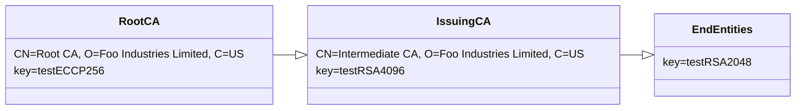

# S/MIME Baseline Requirements Sample Certificate Generator by jsrsasign

## Overview
This project provides generator for certificates and CRLs conforming to CA/Browser Forum S/MIME Baseline Requirements inspired by [smbr-cert-factory](https://github.com/digicert/smbr-cert-factory) project.

## How to generate certificates and CRLs

Download the package from [here](https://github.com/kjur/smbr-cert-generator/archive/refs/heads/main.zip). Then run following:
```
% unzip smbr-cert-generator-main.zip
% cd smbr-cert-generator-main
% cd data
% npm install jsrsasign jsrsasign-util
% sh ./makecert.sh
```
You can see generated certificates and CRLs in `../artifacts` directory.

## Certificate and CRL Customization
All of certificate and CRL parameters are defined as JSON in data directory. So you can modify and add them such as validity period, names, mail addresses or extensions. Here is a `data/mailbox-validated_strict.json`:

```JavaScript
{
  "version": 3,
  "serial": {"hex": "7b2c41983c7f8e0f82fc8fb7b1aedde23882ad4c"},
  "sigalg": "SHA256withRSA",
  "issuer": {
    "str": "/C=US/O=Foo Industries Limited/CN=Intermediate CA",
    "array": [
      [{"type": "C", "ds": "prn", "value": "US"}],
      [{"type": "O", "ds": "utf8", "value": "Foo Industries Limited"}],
      [{"type": "CN", "ds": "utf8", "value": "Intermediate CA"}]
    ]
  },
  "notbefore": "230419000000Z",
  "notafter": "230718235959Z",
  "subject": {
    "str": "/CN=hanako.yamada@example.com/E=hanako.yamada@example.com",
    "array": [
      [{"type": "CN", "ds": "utf8", "value": "hanako.yamada@example.com"}],
      [{"type": "E", "ds": "ia5", "value": "hanako.yamada@example.com"}]
    ]
  },
  "sbjpubkey": "testRSA2048.p8.pub",
  "ext": [
    {
      "extname": "basicConstraints",
      "critical": true
    },
    {
      "extname": "keyUsage",
      "critical": true,
      "names": ["digitalSignature"]
    },
    {
      "extname": "authorityKeyIdentifier",
      "kid": "testRSA4096.p8.pub"
    },
    {
      "extname": "subjectKeyIdentifier",
      "kid": "testRSA2048.p8.pub"
    },
    {
      "extname": "certificatePolicies",
      "array": [{"policyoid": "smimeMailboxStrict"}]
    },
    {
      "extname": "cRLDistributionPoints",
      "array": [
        {"dpname": {"full": [{"uri": "http://crl.ca.example.com/issuing_ca_crl.crl"}]}}
      ]
    },
    {
      "extname": "authorityInfoAccess",
      "array": [{"caissuer": "http://repository.ca.example.com/issuing_ca.der"}]
    },
    {
      "extname": "extKeyUsage",
      "array": ["emailProtection"]
    },
    {
      "extname": "subjectAltName",
      "array": [
        {"rfc822": "hanako.yamada@example.com"},
        {
          "other": {
            "oid": "smtpUTF8Mailbox",
            "value": {"utf8str": {"str": "山田花子@example.com"}}
          }
        }
      ]
    }
  ],
  "cakey": "testRSA4096.p5p.prv"
}
```

## Private and Public Keys
All of private key are defined in the [IETF Internet-Draft Standard PKC Test Keys](https://www.ietf.org/archive/id/draft-gutmann-testkeys-03.html). 

- testECCP256.p5p.prv: EC P-256 curve private key in PEM PKCS#1 format (Root CA)
- testECCP256.p8.pub: EC P-256 curve public key in PEM PKCS#8 format
- testRSA4096.p5p.prv: RSA 4096bit private key in PEM PKCS#1 format (Intermediate CA)
- testRSA4096.p8.pub: RSA 4096 public key in PEM PKCS#8 format
- testRSA2048.p5p.prv: RSA 4096bit private key in PEM PKCS#1 format (End Entity)
- testRSA2048.p8.pub: RSA 4096 public key in PEM PKCS#8 format

Public key files are generated from them by openssl command.
```
% openssl rsa -in testRSA4096.p5p.prv -pubout -out testRSA4096.p8.pub
% openssl ec -in testP256.p5p.prv -pubout -out testP256.p8.pub
```

## Trust Model



## View Generated Certificates

|Root|Intermediate|
|----|------------|
|[view](https://kjur.github.io/pkitool/certview_en.html?#MIIB5TCCAYugAwIBAgIURuz9cGZdtv64wT8gYsAE3px8PNswCgYIKoZIzj0EAwIwQDELMAkGA1UEBhMCVVMxHzAdBgNVBAoMFkZvbyBJbmR1c3RyaWVzIExpbWl0ZWQxEDAOBgNVBAMMB1Jvb3QgQ0EwHhcNMjMwNDE5MDAwMDAwWhcNMjQwNDEzMjM1OTU5WjBAMQswCQYDVQQGEwJVUzEfMB0GA1UECgwWRm9vIEluZHVzdHJpZXMgTGltaXRlZDEQMA4GA1UEAwwHUm9vdCBDQTBZMBMGByqGSM49AgEGCCqGSM49AwEHA0IABEIlSPiPt4L_teyjdERSxyoeVY-9b3O-XkjpMjLMRcWxbEzRDEy41bihcTnpSILImSVymTQl9BQZq36QpCpJQnKjYzBhMA8GA1UdEwEB_wQFMAMBAf8wDgYDVR0PAQH_BAQDAgGGMB8GA1UdIwQYMBaAFFtwp5gX95_2N9L349xEbCEJ17vUMB0GA1UdDgQWBBRbcKeYF_ef9jfS9-PcRGwhCde71DAKBggqhkjOPQQDAgNIADBFAiEAvCmoGYwGtWha6LZuWYKET0NySdlkB9WG1IdhjStdLJkCIHvee5GAaJD-zMhwVQxCFi9uLPHkmPaMZRGNQk-Wn-V0)|[view](https://kjur.github.io/pkitool/certview_en.html?#MIIEdzCCBB2gAwIBAgIUY7oycAbHeK8nyZxuL97QTzdp0G8wCgYIKoZIzj0EAwIwQDELMAkGA1UEBhMCVVMxHzAdBgNVBAoMFkZvbyBJbmR1c3RyaWVzIExpbWl0ZWQxEDAOBgNVBAMMB1Jvb3QgQ0EwHhcNMjMwNDE5MDAwMDAwWhcNMjMxMDE2MjM1OTU5WjBIMQswCQYDVQQGEwJVUzEfMB0GA1UECgwWRm9vIEluZHVzdHJpZXMgTGltaXRlZDEYMBYGA1UEAwwPSW50ZXJtZWRpYXRlIENBMIICIjANBgkqhkiG9w0BAQEFAAOCAg8AMIICCgKCAgEAs4tJYOY75qjbqJqCl47x9jJE5Vd9jPWGFtXKV1nUnMjZNsM4qjy5sRHBSX5bUa9pLyYR5on3Z1SAwLD0w2VPQ6-F_oyK1zTgQqitoF_XZQjgC6D3VsNEO76DPqfRANT7Nn7r1gvbZIZ3_H3rlCRNrRr47tHGWBLAPnxz9_NY6UG8ZkWP97uXpJqYoRgH4CwaO5rTOlc64YDh_0Mq5VgMycq_q2AvMlvNoJfoe8em1040qH1gikP-suT_8fS452hqmEddtRpuvQgXKldBd0kkiyFVyLkG4NVA6Mso9MAK3J_kdYoaw2SrOeThVSiYVEQVP-7GrUxTSLLjj_VQ9fpYM5eTNzDICIG_Ee7o_jhtW1EoSamDmUOr89lyIHaXuOwkEaJhnVXKBCM8WiztxvKG2CnQ6Dcge3ZSmqJEhyEmjcAVC7ewfnMxOnE-WJW6rzrf-mA5WMVn-FzyWx2AondWow0aUKHkaY7amhIrsKp6YPfNImyxFlz8-cqDCmBswPsUh_JJ5eDHHIhibFcSgIHedsEjhLbUSLZ_DnEjru90qIWWA3R1VIPykKfeZkZeInsrFzGPikkFKwFF-6KDdyvCmltYEqzO46tigXAZ5UgH8oiXEre48wO6X-FH-cLzQ0q3A8HZRnNDgqCjU_Tgy76iaku_Ic6eteedR1fX3gJ_IOUCAwEAAaOCASAwggEcMBIGA1UdEwEB_wQIMAYBAf8CAQAwDgYDVR0PAQH_BAQDAgGGMB8GA1UdIwQYMBaAFFtwp5gX95_2N9L349xEbCEJ17vUMB0GA1UdDgQWBBTWRAAyfKgN_6xPa2buta6bLMU4VDARBgNVHSAECjAIMAYGBFUdIAAwOgYDVR0fBDMwMTAvoC2gK4YpaHR0cDovL2NybC5jYS5leGFtcGxlLmNvbS9yb290X2NhX2NybC5jcmwwSAYIKwYBBQUHAQEEPDA6MDgGCCsGAQUFBzAChixodHRwOi8vcmVwb3NpdG9yeS5jYS5leGFtcGxlLmNvbS9yb290X2NhLmRlcjAdBgNVHSUEFjAUBggrBgEFBQcDBAYIKwYBBQUHAwIwCgYIKoZIzj0EAwIDSAAwRQIhAJcb_zeoC7nPOHdamZZlLb1WgkNM48cFksrsITjK2ATHAiBHfwmLpn9pigq07k6KFZcB3kFoIpT7IUxHiFeeEJGetA)|

|    |Strict|Multi Purpose|Legacy|
|----|------|-------------|------|
|Mailbox|[view](https://kjur.github.io/pkitool/certview_en.html?#MIIFjTCCA3WgAwIBAgIUeyxBmDx_jg-C_I-3sa7d4jiCrUwwDQYJKoZIhvcNAQELBQAwSDELMAkGA1UEBhMCVVMxHzAdBgNVBAoMFkZvbyBJbmR1c3RyaWVzIExpbWl0ZWQxGDAWBgNVBAMMD0ludGVybWVkaWF0ZSBDQTAeFw0yMzA0MTkwMDAwMDBaFw0yMzA3MTgyMzU5NTlaME4xIjAgBgNVBAMMGWhhbmFrby55YW1hZGFAZXhhbXBsZS5jb20xKDAmBgkqhkiG9w0BCQEWGWhhbmFrby55YW1hZGFAZXhhbXBsZS5jb20wggEiMA0GCSqGSIb3DQEBAQUAA4IBDwAwggEKAoIBAQCw-egZQ6eumJKq3hfKfED4dE_tL4FI5sjqont9ABVI-1GSqyi1bFBgsRjM0THllIdMbKmJtWwnKW8J-5OgNN8y6Xxv8JmM_Y5vQt2lis0fqXmG8UTz0VTWdlAXXmhUs6lSADvAaIe4RVrCsZ97L3ZQTryY7JRVcbB4khUN3Gp0yg-801SXzoFTTa-UGIRLE66jH51aa5VXu99hnv1OiH8tQrjdi8mH6uG_icq4XuIeNWMF32wHqIOOPvQcWV3M5D2vxJEj702Ku6k9OQXkAo17qRSEonWW4HtLbtmS8He1JNPc_n3dVUm-fM6NoDXPoLP7j55G9zKyqGtGAWXAj1MTAgMBAAGjggFnMIIBYzAMBgNVHRMBAf8EAjAAMA4GA1UdDwEB_wQEAwIHgDAfBgNVHSMEGDAWgBTWRAAyfKgN_6xPa2buta6bLMU4VDAdBgNVHQ4EFgQUiRlZXg7xafXLvUfhNPzimMxpMJEwFAYDVR0gBA0wCzAJBgdngQwBBQEDMD0GA1UdHwQ2MDQwMqAwoC6GLGh0dHA6Ly9jcmwuY2EuZXhhbXBsZS5jb20vaXNzdWluZ19jYV9jcmwuY3JsMEsGCCsGAQUFBwEBBD8wPTA7BggrBgEFBQcwAoYvaHR0cDovL3JlcG9zaXRvcnkuY2EuZXhhbXBsZS5jb20vaXNzdWluZ19jYS5kZXIwEwYDVR0lBAwwCgYIKwYBBQUHAwQwTAYDVR0RBEUwQ4EZaGFuYWtvLnlhbWFkYUBleGFtcGxlLmNvbaAmBggrBgEFBQcICaAaDBjlsbHnlLDoirHlrZBAZXhhbXBsZS5jb20wDQYJKoZIhvcNAQELBQADggIBAKlau83q7snm8DM74D6KlDZXJqhI2ilv1df6_ocNXKQhZk3JsQyhNu1GKNQuEww3AgNPeIc2-0bv3NjY0P_6bdBRBTOB01hVR5mjZ54BTWaU0q4rXIZWpjky1-vW-uRHIlrM7VarU81TiIK2B737RXGEXrgK200pWnHbZ0yzVGBZ2bY3cW9e0fI4MAX51ROtZI7wMXWYRrlOm4SNpCLPOjzec4aK-85tLT25uD3GqnYQz7i2-zgHqbPq3p8dr_lSXRP-yzh115DeCGwwuVEYtqTwCAf_DnJy6sj3oIHg4hj7hp4K2lOXj60Z1Zb8HS3np3lMEkBmpvtVDSwXylOe8GgOiPg5XfF7j7XjUZc2yg1W4nVCEKlTZBvl1PqQ1PHcJty8p1WMjFRSmgbHRVjAUw9S0BdX-znJm5wKwkVuA8kb8JE4hEUb_7ue_gbr1T9gg0nb7ZjtunOq2IaZj--dyll-N4xZHpS0c_Tdn1p-E5rgOklEEKrTJUI13SFxhh6f09CLnEVyWII-Lqj-mThWyGQ5er2ny-dh2TM0G8-btln8XNaoUFIN43aBucKi9uhLQ6ZNVA8KhoczEC4jZwWqeQubVwo5JrKsR5o5GyBWTzpfM5m5_Bqm3cDB3IKRe1RITqQSnAhHXYXFLGhwamKcYlNhDaT_4iJdu2QCJfbDnoD-)|[view](https://kjur.github.io/pkitool/certview_en.html?#MIIFwjCCA6qgAwIBAgIUMJl9bZ1M9s-x2YuIm-g2YLYBRKQwDQYJKoZIhvcNAQELBQAwSDELMAkGA1UEBhMCVVMxHzAdBgNVBAoMFkZvbyBJbmR1c3RyaWVzIExpbWl0ZWQxGDAWBgNVBAMMD0ludGVybWVkaWF0ZSBDQTAeFw0yMzA0MTkwMDAwMDBaFw0yMzA3MTgyMzU5NTlaME4xIjAgBgNVBAMMGWhhbmFrby55YW1hZGFAZXhhbXBsZS5jb20xKDAmBgkqhkiG9w0BCQEWGWhhbmFrby55YW1hZGFAZXhhbXBsZS5jb20wggEiMA0GCSqGSIb3DQEBAQUAA4IBDwAwggEKAoIBAQCw-egZQ6eumJKq3hfKfED4dE_tL4FI5sjqont9ABVI-1GSqyi1bFBgsRjM0THllIdMbKmJtWwnKW8J-5OgNN8y6Xxv8JmM_Y5vQt2lis0fqXmG8UTz0VTWdlAXXmhUs6lSADvAaIe4RVrCsZ97L3ZQTryY7JRVcbB4khUN3Gp0yg-801SXzoFTTa-UGIRLE66jH51aa5VXu99hnv1OiH8tQrjdi8mH6uG_icq4XuIeNWMF32wHqIOOPvQcWV3M5D2vxJEj702Ku6k9OQXkAo17qRSEonWW4HtLbtmS8He1JNPc_n3dVUm-fM6NoDXPoLP7j55G9zKyqGtGAWXAj1MTAgMBAAGjggGcMIIBmDAMBgNVHRMBAf8EAjAAMA4GA1UdDwEB_wQEAwIHgDAfBgNVHSMEGDAWgBTWRAAyfKgN_6xPa2buta6bLMU4VDAdBgNVHQ4EFgQUiRlZXg7xafXLvUfhNPzimMxpMJEwFAYDVR0gBA0wCzAJBgdngQwBBQECMD0GA1UdHwQ2MDQwMqAwoC6GLGh0dHA6Ly9jcmwuY2EuZXhhbXBsZS5jb20vaXNzdWluZ19jYV9jcmwuY3JsMEsGCCsGAQUFBwEBBD8wPTA7BggrBgEFBQcwAoYvaHR0cDovL3JlcG9zaXRvcnkuY2EuZXhhbXBsZS5jb20vaXNzdWluZ19jYS5kZXIwHQYDVR0lBBYwFAYIKwYBBQUHAwQGCCsGAQUFBwMCMHcGA1UdEQRwMG6BGWhhbmFrby55YW1hZGFAZXhhbXBsZS5jb22gKQYKKwYBBAGCNxQCA6AbDBloYW5ha28ueWFtYWRhQGV4YW1wbGUuY29toCYGCCsGAQUFBwgJoBoMGOWxseeUsOiKseWtkEBleGFtcGxlLmNvbTANBgkqhkiG9w0BAQsFAAOCAgEAW3AU7DAAemRO8m__iRlf3T-jOP9WvIpLaVLSqKdmrxsjbCAV0lcRnTv9hHbgJbkOZ-HGiqca0VAUFo8PVz2_UpfF9rUMwi-n-pBNrXm0YEzFWroTDXR4D-1QsPhtW8rMPPrww2VzvJlKd8yzGOdOAg79mHLSI_Eq07l4oSXpTj2ojoWryO4khYaTEkHkWvSBtuonOQDG5tZR6qpLDrSmx1pKlrQ8WmHN3n4up9RipW0sqSUU39wmfLs8WFyFt4c-b3brG8bGVfJXFVmx75jqaQ8m-3xytNNF9imjzPcSsGsDPZXh4D5YvVuZmJ_G0_oYSqCbChJvcfOFNWIRs0o6jIepdLlNSc3cy6Ui--UR6uC_olJjXwzGFt3aWhlNU9BIt-7suR5rRDTKqSv53h2IjrWCp8lTMw-U-rBPS3NYiZeCLpM_Xgfy4fZUF-iXghdv7nt8F2Xwi_W3shdlOoA90UEx_2LRtcY1HRRB2HD4FzGExwh536cxWcT3uF_4BYURqkvcOj3qEHIzzU1U1Xk9OtPgCay_GwWv44btl3kJwFpFvSJHAn5bTBCqrbPDv7FIjKfUTngmTbegiopZi-nwEUoeDB-yyPdTwpYbiBmHjy3bHyNBlDiUF3W9Oz2SSFx7I-W1-jfXwzNUQvVl57B5ynZWzWAPU0dYk9M8AFGPhC8)|[view](https://kjur.github.io/pkitool/certview_en.html?#MIIGJDCCBAygAwIBAgIUb8q8UM5hVWuhxhL5ZZ7VZephK5YwDQYJKoZIhvcNAQELBQAwSDELMAkGA1UEBhMCVVMxHzAdBgNVBAoMFkZvbyBJbmR1c3RyaWVzIExpbWl0ZWQxGDAWBgNVBAMMD0ludGVybWVkaWF0ZSBDQTAeFw0yMzA0MDEwMDAwMDBaFw0yNTA3MDQwMDAwMDBaME4xIjAgBgNVBAMMGWhhbmFrby55YW1hZGFAZXhhbXBsZS5jb20xKDAmBgkqhkiG9w0BCQEWGWhhbmFrby55YW1hZGFAZXhhbXBsZS5jb20wggEiMA0GCSqGSIb3DQEBAQUAA4IBDwAwggEKAoIBAQCw-egZQ6eumJKq3hfKfED4dE_tL4FI5sjqont9ABVI-1GSqyi1bFBgsRjM0THllIdMbKmJtWwnKW8J-5OgNN8y6Xxv8JmM_Y5vQt2lis0fqXmG8UTz0VTWdlAXXmhUs6lSADvAaIe4RVrCsZ97L3ZQTryY7JRVcbB4khUN3Gp0yg-801SXzoFTTa-UGIRLE66jH51aa5VXu99hnv1OiH8tQrjdi8mH6uG_icq4XuIeNWMF32wHqIOOPvQcWV3M5D2vxJEj702Ku6k9OQXkAo17qRSEonWW4HtLbtmS8He1JNPc_n3dVUm-fM6NoDXPoLP7j55G9zKyqGtGAWXAj1MTAgMBAAGjggH-MIIB-jAMBgNVHRMBAf8EAjAAMA4GA1UdDwEB_wQEAwIE8DAfBgNVHSMEGDAWgBTWRAAyfKgN_6xPa2buta6bLMU4VDAdBgNVHQ4EFgQUiRlZXg7xafXLvUfhNPzimMxpMJEwFAYDVR0gBA0wCzAJBgdngQwBBQEBMIGeBgNVHR8EgZYwgZMwMqAwoC6GLGh0dHA6Ly9jcmwuY2EuZXhhbXBsZS5jb20vaXNzdWluZ19jYV9jcmwuY3JsMF2gW6BZhldsZGFwOi8vL0NOPUlDQSxPPUZvb0x0ZD9jZXJ0aWZpY2F0ZVJldm9jYXRpb25MaXN0P2Jhc2U_b2JqZWN0Q2xhc3M9Y1JMRGlzdHJpYnV0aW9uUG9pbnQwSwYIKwYBBQUHAQEEPzA9MDsGCCsGAQUFBzAChi9odHRwOi8vcmVwb3NpdG9yeS5jYS5leGFtcGxlLmNvbS9pc3N1aW5nX2NhLmRlcjAdBgNVHSUEFjAUBggrBgEFBQcDBAYIKwYBBQUHAwIwdwYDVR0RBHAwboEZaGFuYWtvLnlhbWFkYUBleGFtcGxlLmNvbaApBgorBgEEAYI3FAIDoBsMGWhhbmFrby55YW1hZGFAZXhhbXBsZS5jb22gJgYIKwYBBQUHCAmgGgwY5bGx55Sw6Iqx5a2QQGV4YW1wbGUuY29tMA0GCSqGSIb3DQEBCwUAA4ICAQCA1idO9jEel9V2P-oHd1_457EWUH2YEjU81NcA4sTOJfqj3YSW-6jCiC_Y0wZ1vsZwfL_AJtHGXb0aDsjwbCt9-Ex6xbRFMQySKJlTNPMyyTYhj0rC7lbx-rpcIqhUXIyNwrkFwEdtWc2X-PtlU7TdfkPOZQrpmrAQ6FrVVuMc17YlDqxMouJNhlqWeVhj3o5Kj8pnPYRJjvBH5OlyPH3sPXqmgyAt0fmhefPya-Yfb948DUM9OzrwT3Qi-EVFxEyJ0s2lIPxm4msEh80aZSgWbo9BqA-wyCXp9cehla5b0_QvmruWYgeetvW98fKPtQVfcYHFeo-quMV7RqpZjz8bFQ9HM7T8QCAu9Cat0F8-EKT5_P1Cjo_GYDIVJcvY1iIz-xk1tqGIabycJZqHtLafO3QzI_MdqSJT3Xh_rjApaOAOR0N_mryTISWg2bxZXoUKNXyUQxDBXktmXdndQj0hWOXSGNR0SOmsKmr8gP5FCKsiP6JV2ghsZNuWS44j0mc_LGF9Li_qIlVXJHBkJ79xq3-BcJKT-fo3MN7WX8WJzitZHyElA4y7DlKrG2dp91ezG6ppJsjKpaKrNODPs99pjQ40F7yLmL3b2LUcM2_5U-TukaKgoBMgVv2j3OV50ecERmlwqdla3EMSHwdfj6lr6POtBPR3oTL-HKgvDu0N5g)|
|Organization|[view](https://kjur.github.io/pkitool/certview_en.html?#MIIGJTCCBA2gAwIBAgIUNJtV5uv0G7kjd4e9f4qR8QhOcRYwDQYJKoZIhvcNAQELBQAwSDELMAkGA1UEBhMCVVMxHzAdBgNVBAoMFkZvbyBJbmR1c3RyaWVzIExpbWl0ZWQxGDAWBgNVBAMMD0ludGVybWVkaWF0ZSBDQTAeFw0yMzA0MTkwMDAwMDBaFw0yMzA3MTgyMzU5NTlaMG8xIzAhBgNVBGETGkxFSVhHLUFFWUUwMEVLWEVTVlpVVUVCUDY3MR4wHAYDVQQKExVBY21lIEluZHVzdHJpZXMsIEx0ZC4xKDAmBgkqhkiG9w0BCQEWGWhhbmFrby55YW1hZGFAZXhhbXBsZS5jb20wggEiMA0GCSqGSIb3DQEBAQUAA4IBDwAwggEKAoIBAQCw-egZQ6eumJKq3hfKfED4dE_tL4FI5sjqont9ABVI-1GSqyi1bFBgsRjM0THllIdMbKmJtWwnKW8J-5OgNN8y6Xxv8JmM_Y5vQt2lis0fqXmG8UTz0VTWdlAXXmhUs6lSADvAaIe4RVrCsZ97L3ZQTryY7JRVcbB4khUN3Gp0yg-801SXzoFTTa-UGIRLE66jH51aa5VXu99hnv1OiH8tQrjdi8mH6uG_icq4XuIeNWMF32wHqIOOPvQcWV3M5D2vxJEj702Ku6k9OQXkAo17qRSEonWW4HtLbtmS8He1JNPc_n3dVUm-fM6NoDXPoLP7j55G9zKyqGtGAWXAj1MTAgMBAAGjggHeMIIB2jAMBgNVHRMBAf8EAjAAMA4GA1UdDwEB_wQEAwIHgDAfBgNVHSMEGDAWgBTWRAAyfKgN_6xPa2buta6bLMU4VDAdBgNVHQ4EFgQUiRlZXg7xafXLvUfhNPzimMxpMJEwFAYDVR0gBA0wCzAJBgdngQwBBQIDMD0GA1UdHwQ2MDQwMqAwoC6GLGh0dHA6Ly9jcmwuY2EuZXhhbXBsZS5jb20vaXNzdWluZ19jYV9jcmwuY3JsMEsGCCsGAQUFBwEBBD8wPTA7BggrBgEFBQcwAoYvaHR0cDovL3JlcG9zaXRvcnkuY2EuZXhhbXBsZS5jb20vaXNzdWluZ19jYS5kZXIwEwYDVR0lBAwwCgYIKwYBBQUHAwQwgZ0GA1UdEQSBlTCBkoEZaGFuYWtvLnlhbWFkYUBleGFtcGxlLmNvbaAmBggrBgEFBQcICaAaDBjlsbHnlLDoirHlrZBAZXhhbXBsZS5jb22kTTBLMSMwIQYDVQRhExpMRUlYRy1BRVlFMDBFS1hFU1ZaVVVFQlA2NzEkMCIGA1UECgwb44Ki44Kv44Of5bel5qWt5qCq5byP5Lya56S-MCMGCSsGAQQBg5gqAQQWExRBRVlFMDBFS1hFU1ZaVVVFQlA2NzANBgkqhkiG9w0BAQsFAAOCAgEAMfvxrD12chKJqibvkK0YgY5aPiJ3ti_0RaBhLwFD9olei9yp0Qle58VVtjmQDnmqguYI4MICgZhKMwTE9R-QffqJhxq5FKpNbw8b2gQ5lGIUtal--0G-ybAB-SAglw6pLe2C06G0WHIYRFCjg1IT7slEQYF-ltWsFoej_AcKBFc61jVvl5NJQDPxpKdElBZ4Ogc1_S5Kv6pga0ZN_HtAVDDdcUqSjRURBlRmx_wPFGgNQaHxuhyrIccvmqTuRGFocFp7T_h9kxf7qdh6cU5q6o_bzLN0KJ0F_QcMNZPU-wNlPkgKk95I9ni9ttVmVpr2whrhCzmaHphcHSvwNDMI3lzu1f5gOuzojmN3VER_CbtxeyI_ymNpNhu4rjsibKOgZ0sJbW4BvI7NEwKGnF34T_J_5OGGl5atr1BJcHc-7Q1S6XN9dno5mruXW56RWUCVO49pWMozaZHsXs3STYJLmiAqruc1EuANueA9bo0NASKCFx_l3D9Xi8Ago7z7QJy2R10bH7xzHNTDZTZSsXr-vH4a2tSbFxPDW0Z4sI9ZgNCGVEdIJzeFEtmWWPRRBw-LjhHMcMx7v1KhpfoAtfsSep-3wscwcJL7-Mr6zR7NgGPgbtdlSX8k6PjkWGvtuiHhRpJKVqbG-_KVl2HbsnYCRp9Yb2NF6R_aSrSL0BRT4zA)|[view](https://kjur.github.io/pkitool/certview_en.html?#MIIGWjCCBEKgAwIBAgIUKc1p3itxImZBVQJutdZ1hR5f6cQwDQYJKoZIhvcNAQELBQAwSDELMAkGA1UEBhMCVVMxHzAdBgNVBAoMFkZvbyBJbmR1c3RyaWVzIExpbWl0ZWQxGDAWBgNVBAMMD0ludGVybWVkaWF0ZSBDQTAeFw0yMzA0MTkwMDAwMDBaFw0yMzA3MTgyMzU5NTlaMG8xIzAhBgNVBGETGkxFSVhHLUFFWUUwMEVLWEVTVlpVVUVCUDY3MR4wHAYDVQQKExVBY21lIEluZHVzdHJpZXMsIEx0ZC4xKDAmBgkqhkiG9w0BCQEWGWhhbmFrby55YW1hZGFAZXhhbXBsZS5jb20wggEiMA0GCSqGSIb3DQEBAQUAA4IBDwAwggEKAoIBAQCw-egZQ6eumJKq3hfKfED4dE_tL4FI5sjqont9ABVI-1GSqyi1bFBgsRjM0THllIdMbKmJtWwnKW8J-5OgNN8y6Xxv8JmM_Y5vQt2lis0fqXmG8UTz0VTWdlAXXmhUs6lSADvAaIe4RVrCsZ97L3ZQTryY7JRVcbB4khUN3Gp0yg-801SXzoFTTa-UGIRLE66jH51aa5VXu99hnv1OiH8tQrjdi8mH6uG_icq4XuIeNWMF32wHqIOOPvQcWV3M5D2vxJEj702Ku6k9OQXkAo17qRSEonWW4HtLbtmS8He1JNPc_n3dVUm-fM6NoDXPoLP7j55G9zKyqGtGAWXAj1MTAgMBAAGjggITMIICDzAMBgNVHRMBAf8EAjAAMA4GA1UdDwEB_wQEAwIHgDAfBgNVHSMEGDAWgBTWRAAyfKgN_6xPa2buta6bLMU4VDAdBgNVHQ4EFgQUiRlZXg7xafXLvUfhNPzimMxpMJEwFAYDVR0gBA0wCzAJBgdngQwBBQICMD0GA1UdHwQ2MDQwMqAwoC6GLGh0dHA6Ly9jcmwuY2EuZXhhbXBsZS5jb20vaXNzdWluZ19jYV9jcmwuY3JsMEsGCCsGAQUFBwEBBD8wPTA7BggrBgEFBQcwAoYvaHR0cDovL3JlcG9zaXRvcnkuY2EuZXhhbXBsZS5jb20vaXNzdWluZ19jYS5kZXIwHQYDVR0lBBYwFAYIKwYBBQUHAwQGCCsGAQUFBwMCMIHIBgNVHREEgcAwgb2BGWhhbmFrby55YW1hZGFAZXhhbXBsZS5jb22gKQYKKwYBBAGCNxQCA6AbDBloYW5ha28ueWFtYWRhQGV4YW1wbGUuY29toCYGCCsGAQUFBwgJoBoMGOWxseeUsOiKseWtkEBleGFtcGxlLmNvbaRNMEsxIzAhBgNVBGETGkxFSVhHLUFFWUUwMEVLWEVTVlpVVUVCUDY3MSQwIgYDVQQKDBvjgqLjgq_jg5_lt6Xmpa3moKrlvI_kvJrnpL4wIwYJKwYBBAGDmCoBBBYTFEFFWUUwMEVLWEVTVlpVVUVCUDY3MA0GCSqGSIb3DQEBCwUAA4ICAQAK_42FvomyFyzFBJZHqVFnMDzSgirIYxNcPHguvYsOkaa_1Fap4FxLrh3Tn6ZlHd29f49pHqY4_-BanUmVLL1NSU0KnY6CxlfdAZn_LWlKO3eReRAMD6Y1ORlVnXINysNQ6JFNZ2x2Cc4d2p3vW1mXoZBjAcVyq2dROEXefNMP943Xtbm7GxDkBZB-i6ah6WBbyv9luufQrR3aj-wMg245fDtu7NW3g1ApO1bSacpwvArOWjMCO2VRjUrGLWtZn1PuZfGUzlIEzkljQOnlo__RUoRC4hBbZtIlvSc3LZXNZLToeBD3KFZChF4XQxs-p9GIwCgqdWNzRCt043YeBljlBSsC4LLbVYWtIIAaVx0aoT6lpGOwcY0qZgdxi-cdM-ivWOdHSkTP6OdnwRYzEsNF8jDPrkuse-16SVuHyHvlOjaPDut1oLpEQeuqb0fLsY-MlmUiQ9OfwEAjWOrHTzCopeH-1Ghh32GcNMQA7TKyH2EIbeWUFwmPqMgxPlFSKZUMbBonHwZ9QO-1glBssRJtrxiZMtMKlL3XsT82wMzrX5eseVKF2ISGXoCQe0S8mWbZIcRz9QyTx6DhChtsQMqpBdCIGzVnhSzpWIZcTJEUDSj1zvHdW7znGE6lilsuh1j-sxEW0kNmPFpgRF0PzKwMQK_YMr2czYdFTscAQaE8Iw)|[view](https://kjur.github.io/pkitool/certview_en.html?#MIIHBzCCBO-gAwIBAgIUHQXbPf7x9SJJ8UI9ofVcJonftxswDQYJKoZIhvcNAQELBQAwSDELMAkGA1UEBhMCVVMxHzAdBgNVBAoMFkZvbyBJbmR1c3RyaWVzIExpbWl0ZWQxGDAWBgNVBAMMD0ludGVybWVkaWF0ZSBDQTAeFw0yMzA0MDEwMDAwMDBaFw0yNTA3MDQwMDAwMDBaMIGdMSMwIQYDVQRhExpMRUlYRy1BRVlFMDBFS1hFU1ZaVVVFQlA2NzEeMBwGA1UEChMVQWNtZSBJbmR1c3RyaWVzLCBMdGQuMRMwEQYKCZImiZPyLGQBGRMDY29tMRcwFQYKCZImiZPyLGQBGRMHZXhhbXBsZTEoMCYGCSqGSIb3DQEJARYZaGFuYWtvLnlhbWFkYUBleGFtcGxlLmNvbTCCASIwDQYJKoZIhvcNAQEBBQADggEPADCCAQoCggEBALD56BlDp66YkqreF8p8QPh0T-0vgUjmyOqie30AFUj7UZKrKLVsUGCxGMzRMeWUh0xsqYm1bCcpbwn7k6A03zLpfG_wmYz9jm9C3aWKzR-peYbxRPPRVNZ2UBdeaFSzqVIAO8Boh7hFWsKxn3svdlBOvJjslFVxsHiSFQ3canTKD7zTVJfOgVNNr5QYhEsTrqMfnVprlVe732Ge_U6Ify1CuN2LyYfq4b-Jyrhe4h41YwXfbAeog44-9BxZXczkPa_EkSPvTYq7qT05BeQCjXupFISidZbge0tu2ZLwd7Uk09z-fd1VSb58zo2gNc-gs_uPnkb3MrKoa0YBZcCPUxMCAwEAAaOCApEwggKNMAwGA1UdEwEB_wQCMAAwDgYDVR0PAQH_BAQDAgTwMB8GA1UdIwQYMBaAFNZEADJ8qA3_rE9rZu61rpssxThUMB0GA1UdDgQWBBSJGVleDvFp9cu9R-E0_OKYzGkwkTAUBgNVHSAEDTALMAkGB2eBDAEFAgEwgZ4GA1UdHwSBljCBkzAyoDCgLoYsaHR0cDovL2NybC5jYS5leGFtcGxlLmNvbS9pc3N1aW5nX2NhX2NybC5jcmwwXaBboFmGV2xkYXA6Ly8vQ049SUNBLE89Rm9vTHRkP2NlcnRpZmljYXRlUmV2b2NhdGlvbkxpc3Q_YmFzZT9vYmplY3RDbGFzcz1jUkxEaXN0cmlidXRpb25Qb2ludDBLBggrBgEFBQcBAQQ_MD0wOwYIKwYBBQUHMAKGL2h0dHA6Ly9yZXBvc2l0b3J5LmNhLmV4YW1wbGUuY29tL2lzc3VpbmdfY2EuZGVyMB0GA1UdJQQWMBQGCCsGAQUFBwMEBggrBgEFBQcDAjCByAYDVR0RBIHAMIG9gRloYW5ha28ueWFtYWRhQGV4YW1wbGUuY29toCkGCisGAQQBgjcUAgOgGwwZaGFuYWtvLnlhbWFkYUBleGFtcGxlLmNvbaAmBggrBgEFBQcICaAaDBjlsbHnlLDoirHlrZBAZXhhbXBsZS5jb22kTTBLMSMwIQYDVQRhExpMRUlYRy1BRVlFMDBFS1hFU1ZaVVVFQlA2NzEkMCIGA1UECgwb44Ki44Kv44Of5bel5qWt5qCq5byP5Lya56S-MCMGCSsGAQQBg5gqAQQWExRBRVlFMDBFS1hFU1ZaVVVFQlA2NzAaBgNVHQkEEzARMA8GCCsGAQUFBwkDMQMTAUYwDQYJKoZIhvcNAQELBQADggIBACgqWbNSCBCxPLBJlFA6fGGIJ2wYzro2LzVAIBG7xJOZBSUu25NQifQdFdZBbHUKntg-A4N0Gh8xmfkmoeLOwsezZ-SZUrWWQrT31U-N41U0Q-nIX0qGtRp7Uwdnd9NCHxfcnHXVMnr3y9uQJx7PT30Ml60Uuk3czQ7JNPFlpapYupDd39fnbb_w2yo0yobeutSnKCKc1iUATkeE3dBSaUQOogq1xKI2kwXELmljGe9WL_PZfE8q1pQ5-PdB0hIUDtrN9RpV_id10LQs3Kl-l8naNhQ50wYls7lMXLJheuzoDO0dbJSYpgd1NDrpCFwVtnsn6VQB_oXTPhdMaheWC3joydIoJKOAUKzcdQ1o8713taZEswQlgGZk0mr9GEQ5qM6M91s0cCt2UktJWce_PNG5Bx2oi2uo2IUilI1BD6DZzHRB2VF5z8H3IwqDPrsd3DTdEZ5pCSe7xdnIRsQBE4wBABINbBmTAkB8YAZHAeLlqyYUV3lBfjVHNsYEgIf1eG8jNYVcMEttd0Z2Wh0lPeUz5UMF3lwCkmjJq63V-__X0Jxo9XiBiVR5Qns7QmpPFK0BKj7_RFFQlFUnbp5wVZu34MZEkb0x2uQCW6GPwRDqNQQ-mpwTDED1p9a_mme_1RRvnmS3M7r7Z4CvAgf7rPrmWLfOcda6YenNx5_-SE0R)|
|Sponsored|[view](https://kjur.github.io/pkitool/certview_en.html?#MIIGrzCCBJegAwIBAgIUcbLmxpirUQmFPwRqbYs__8yu_4owDQYJKoZIhvcNAQELBQAwSDELMAkGA1UEBhMCVVMxHzAdBgNVBAoMFkZvbyBJbmR1c3RyaWVzIExpbWl0ZWQxGDAWBgNVBAMMD0ludGVybWVkaWF0ZSBDQTAeFw0yMzA0MTkwMDAwMDBaFw0yMzA3MTgyMzU5NTlaMIGpMSMwIQYDVQRhExpMRUlYRy1BRVlFMDBFS1hFU1ZaVVVFQlA2NzEeMBwGA1UEChMVQWNtZSBJbmR1c3RyaWVzLCBMdGQuMQ8wDQYDVQQEDAZZYW1hZGExDzANBgNVBCoMBkhhbmFrbzEWMBQGA1UEAwwNWUFNQURBIEhhbmFrbzEoMCYGCSqGSIb3DQEJARYZaGFuYWtvLnlhbWFkYUBleGFtcGxlLmNvbTCCASIwDQYJKoZIhvcNAQEBBQADggEPADCCAQoCggEBALD56BlDp66YkqreF8p8QPh0T-0vgUjmyOqie30AFUj7UZKrKLVsUGCxGMzRMeWUh0xsqYm1bCcpbwn7k6A03zLpfG_wmYz9jm9C3aWKzR-peYbxRPPRVNZ2UBdeaFSzqVIAO8Boh7hFWsKxn3svdlBOvJjslFVxsHiSFQ3canTKD7zTVJfOgVNNr5QYhEsTrqMfnVprlVe732Ge_U6Ify1CuN2LyYfq4b-Jyrhe4h41YwXfbAeog44-9BxZXczkPa_EkSPvTYq7qT05BeQCjXupFISidZbge0tu2ZLwd7Uk09z-fd1VSb58zo2gNc-gs_uPnkb3MrKoa0YBZcCPUxMCAwEAAaOCAi0wggIpMAwGA1UdEwEB_wQCMAAwDgYDVR0PAQH_BAQDAgeAMB8GA1UdIwQYMBaAFNZEADJ8qA3_rE9rZu61rpssxThUMB0GA1UdDgQWBBSJGVleDvFp9cu9R-E0_OKYzGkwkTAUBgNVHSAEDTALMAkGB2eBDAEFAwMwPQYDVR0fBDYwNDAyoDCgLoYsaHR0cDovL2NybC5jYS5leGFtcGxlLmNvbS9pc3N1aW5nX2NhX2NybC5jcmwwSwYIKwYBBQUHAQEEPzA9MDsGCCsGAQUFBzAChi9odHRwOi8vcmVwb3NpdG9yeS5jYS5leGFtcGxlLmNvbS9pc3N1aW5nX2NhLmRlcjATBgNVHSUEDDAKBggrBgEFBQcDBDCB2AYDVR0RBIHQMIHNgRloYW5ha28ueWFtYWRhQGV4YW1wbGUuY29toCYGCCsGAQUFBwgJoBoMGOWxseeUsOiKseWtkEBleGFtcGxlLmNvbaSBhzCBhDEjMCEGA1UEYRMaTEVJWEctQUVZRTAwRUtYRVNWWlVVRUJQNjcxJDAiBgNVBAoMG-OCouOCr-ODn-W3pealreagquW8j-S8muekvjEPMA0GA1UEBAwG5bGx55SwMQ8wDQYDVQQqDAboirHlrZAxFTATBgNVBAMMDOWxseeUsOiKseWtkDAjBgkrBgEEAYOYKgEEFhMUQUVZRTAwRUtYRVNWWlVVRUJQNjcwEgYJKwYBBAGDmCoCBAUTA0NFTzANBgkqhkiG9w0BAQsFAAOCAgEAcv5Du6tNoQQkin2ODr1sBR6tXB97G8dxldpHrYuCvGaDesSIAwlmXxoykIcJsHZOiyXaowAjujCTx060mtpvaX_0hQsduhSolnftLn-PtkN5o0xNciW0GeQP8CgaKAB6e0Z62S8SaQpMjHTPPHZmwY02AU02QolXUQ2qEwKSIsKvsogU4Wk-DjzsfVUbILFE9qTlfUICHr6J322aRm2a_JrKr8fLiwMTuZrXBNOOlYNBaoOCSVvELFJKbLXEYn38vfUivbSKAWhLo_b-0UVaxFQSolSKIy4C4F5NWmNS4wy_p7tMartDdJHSpfwxDu9n1lMapuCp1mLigk596yWn6OhqSmzS0UKU-6KR4AMMOx_Bqsv6OB7n5aUI9tnXsjXAfn1MQg0yheWWlqXvtj1qZAtORuXtz6KCf78nssvUfgUmf5jx_LkY_BGlOTiRq18ABMrQtUy9KytGpX1OCLwoZw1Qujtq4gbdwuMRAAVRSkuINMY-RfJCZsGEFKZ8RjyvDZx4FOCawnh9Z02TOb7riCLJRn0kzj_R3lQndO0MAxX96-ZRvOxsjFSBRxdOUXFv1NCYNKI5GCA_MX_LAFPs_ays7qSHJ8PUJaC9EOa7n6iCqhxr-c99FzS-e0wXbJ6_QOrY_eGxUAoNc-WSsjXkVLIwv3X0UHsDpA_5ftr3k1g)|[view](https://kjur.github.io/pkitool/certview_en.html?#MIIG5TCCBM2gAwIBAgIUMU2JD1kirfj822F-fYt2YmrzSJcwDQYJKoZIhvcNAQELBQAwSDELMAkGA1UEBhMCVVMxHzAdBgNVBAoMFkZvbyBJbmR1c3RyaWVzIExpbWl0ZWQxGDAWBgNVBAMMD0ludGVybWVkaWF0ZSBDQTAeFw0yMzA0MTkwMDAwMDBaFw0yMzA3MTgyMzU5NTlaMIGpMSMwIQYDVQRhExpMRUlYRy1BRVlFMDBFS1hFU1ZaVVVFQlA2NzEeMBwGA1UEChMVQWNtZSBJbmR1c3RyaWVzLCBMdGQuMQ8wDQYDVQQEDAZZYW1hZGExDzANBgNVBCoMBkhhbmFrbzEWMBQGA1UEAwwNWUFNQURBIEhhbmFrbzEoMCYGCSqGSIb3DQEJARYZaGFuYWtvLnlhbWFkYUBleGFtcGxlLmNvbTCCASIwDQYJKoZIhvcNAQEBBQADggEPADCCAQoCggEBALD56BlDp66YkqreF8p8QPh0T-0vgUjmyOqie30AFUj7UZKrKLVsUGCxGMzRMeWUh0xsqYm1bCcpbwn7k6A03zLpfG_wmYz9jm9C3aWKzR-peYbxRPPRVNZ2UBdeaFSzqVIAO8Boh7hFWsKxn3svdlBOvJjslFVxsHiSFQ3canTKD7zTVJfOgVNNr5QYhEsTrqMfnVprlVe732Ge_U6Ify1CuN2LyYfq4b-Jyrhe4h41YwXfbAeog44-9BxZXczkPa_EkSPvTYq7qT05BeQCjXupFISidZbge0tu2ZLwd7Uk09z-fd1VSb58zo2gNc-gs_uPnkb3MrKoa0YBZcCPUxMCAwEAAaOCAmMwggJfMAwGA1UdEwEB_wQCMAAwDgYDVR0PAQH_BAQDAgeAMB8GA1UdIwQYMBaAFNZEADJ8qA3_rE9rZu61rpssxThUMB0GA1UdDgQWBBSJGVleDvFp9cu9R-E0_OKYzGkwkTAUBgNVHSAEDTALMAkGB2eBDAEFAwIwPQYDVR0fBDYwNDAyoDCgLoYsaHR0cDovL2NybC5jYS5leGFtcGxlLmNvbS9pc3N1aW5nX2NhX2NybC5jcmwwSwYIKwYBBQUHAQEEPzA9MDsGCCsGAQUFBzAChi9odHRwOi8vcmVwb3NpdG9yeS5jYS5leGFtcGxlLmNvbS9pc3N1aW5nX2NhLmRlcjAdBgNVHSUEFjAUBggrBgEFBQcDBAYIKwYBBQUHAwIwggEDBgNVHREEgfswgfiBGWhhbmFrby55YW1hZGFAZXhhbXBsZS5jb22gKQYKKwYBBAGCNxQCA6AbDBloYW5ha28ueWFtYWRhQGV4YW1wbGUuY29toCYGCCsGAQUFBwgJoBoMGOWxseeUsOiKseWtkEBleGFtcGxlLmNvbaSBhzCBhDEjMCEGA1UEYRMaTEVJWEctQUVZRTAwRUtYRVNWWlVVRUJQNjcxJDAiBgNVBAoMG-OCouOCr-ODn-W3pealreagquW8j-S8muekvjEPMA0GA1UEBAwG5bGx55SwMQ8wDQYDVQQqDAboirHlrZAxFTATBgNVBAMMDOWxseeUsOiKseWtkDAjBgkrBgEEAYOYKgEEFhMUQUVZRTAwRUtYRVNWWlVVRUJQNjcwEgYJKwYBBAGDmCoCBAUTA0NFTzANBgkqhkiG9w0BAQsFAAOCAgEAqCaSkpd5zbvo3DRQHaUT_cvVgoRARYqFKsia_mB29By-uea6G1um8TpomTIDCpT2plK8G7erqjBewDRMEMI4nJkxxW1Q9SbOcVscBiG7B7QHLiiiRKNkk48AoqQNZ_IkXcr9kFRxShwiL3Az6ug6IzDzXD23btf9jCDYJdG8VZao6Id-V9QQxgNTeLz7P9XJYRxTikHXKeRabwSTdrBPXpJYRmg1Ut7PO5k5PBZzgDuUvNt1Yc7mHW9vOeFEF6httx-LeNu2jSwI-5091xoq1HZdHOXKzBn47HzobCt7bDuaYxz1stPI_rKjO1EhOZFENxhXiTJgk_T7q4zBdI9ux701gH8J_I7NEV87D3BTZCPMxqoCKFsiUYcnT_z0XXmnqo937PZCMQkK-cuzeLHuI3UvCGIFAiQoGfuDZSS_qXh67RzhEtQMJDrMf45fGeIt1NfdMy59GWTVGKzCPIPeckx3O7QZM29ip3v7i_gi06VPYRGLQfr7sLSBES_eMDfB7IJLo1xn4cDuzSgR9QtkWZtfmrQUto6ch1aT2tLjlmPSTPrcEzEoQ6Ey5xhheJfMH_2AiMD6NuPaCn8E6_dciMe7bI1nNHzBT4aBDB7VzAPPII09IJWEtJ_wM1Kv_rE_2zhdXgFjDUUHn1ArQOKp_2ABKD7BS2Tb8y-zmw-eUy4)|[view](https://kjur.github.io/pkitool/certview_en.html?#MIIHkTCCBXmgAwIBAgIUBKdDVm4KxQ4u7Pu9Oe1mGCGySUEwDQYJKoZIhvcNAQELBQAwSDELMAkGA1UEBhMCVVMxHzAdBgNVBAoMFkZvbyBJbmR1c3RyaWVzIExpbWl0ZWQxGDAWBgNVBAMMD0ludGVybWVkaWF0ZSBDQTAeFw0yMzA0MDEwMDAwMDBaFw0yNTA3MDQwMDAwMDBaMIHXMSMwIQYDVQRhExpMRUlYRy1BRVlFMDBFS1hFU1ZaVVVFQlA2NzEeMBwGA1UEChMVQWNtZSBJbmR1c3RyaWVzLCBMdGQuMRMwEQYKCZImiZPyLGQBGRMDY29tMRcwFQYKCZImiZPyLGQBGRMHZXhhbXBsZTEPMA0GA1UEBAwGWWFtYWRhMQ8wDQYDVQQqDAZIYW5ha28xFjAUBgNVBAMMDVlBTUFEQSBIYW5ha28xKDAmBgkqhkiG9w0BCQEWGWhhbmFrby55YW1hZGFAZXhhbXBsZS5jb20wggEiMA0GCSqGSIb3DQEBAQUAA4IBDwAwggEKAoIBAQCw-egZQ6eumJKq3hfKfED4dE_tL4FI5sjqont9ABVI-1GSqyi1bFBgsRjM0THllIdMbKmJtWwnKW8J-5OgNN8y6Xxv8JmM_Y5vQt2lis0fqXmG8UTz0VTWdlAXXmhUs6lSADvAaIe4RVrCsZ97L3ZQTryY7JRVcbB4khUN3Gp0yg-801SXzoFTTa-UGIRLE66jH51aa5VXu99hnv1OiH8tQrjdi8mH6uG_icq4XuIeNWMF32wHqIOOPvQcWV3M5D2vxJEj702Ku6k9OQXkAo17qRSEonWW4HtLbtmS8He1JNPc_n3dVUm-fM6NoDXPoLP7j55G9zKyqGtGAWXAj1MTAgMBAAGjggLhMIIC3TAMBgNVHRMBAf8EAjAAMA4GA1UdDwEB_wQEAwIE8DAfBgNVHSMEGDAWgBTWRAAyfKgN_6xPa2buta6bLMU4VDAdBgNVHQ4EFgQUiRlZXg7xafXLvUfhNPzimMxpMJEwFAYDVR0gBA0wCzAJBgdngQwBBQMBMIGeBgNVHR8EgZYwgZMwMqAwoC6GLGh0dHA6Ly9jcmwuY2EuZXhhbXBsZS5jb20vaXNzdWluZ19jYV9jcmwuY3JsMF2gW6BZhldsZGFwOi8vL0NOPUlDQSxPPUZvb0x0ZD9jZXJ0aWZpY2F0ZVJldm9jYXRpb25MaXN0P2Jhc2U_b2JqZWN0Q2xhc3M9Y1JMRGlzdHJpYnV0aW9uUG9pbnQwSwYIKwYBBQUHAQEEPzA9MDsGCCsGAQUFBzAChi9odHRwOi8vcmVwb3NpdG9yeS5jYS5leGFtcGxlLmNvbS9pc3N1aW5nX2NhLmRlcjAdBgNVHSUEFjAUBggrBgEFBQcDBAYIKwYBBQUHAwIwggEDBgNVHREEgfswgfiBGWhhbmFrby55YW1hZGFAZXhhbXBsZS5jb22gKQYKKwYBBAGCNxQCA6AbDBloYW5ha28ueWFtYWRhQGV4YW1wbGUuY29toCYGCCsGAQUFBwgJoBoMGOWxseeUsOiKseWtkEBleGFtcGxlLmNvbaSBhzCBhDEjMCEGA1UEYRMaTEVJWEctQUVZRTAwRUtYRVNWWlVVRUJQNjcxJDAiBgNVBAoMG-OCouOCr-ODn-W3pealreagquW8j-S8muekvjEPMA0GA1UEBAwG5bGx55SwMQ8wDQYDVQQqDAboirHlrZAxFTATBgNVBAMMDOWxseeUsOiKseWtkDAjBgkrBgEEAYOYKgEEFhMUQUVZRTAwRUtYRVNWWlVVRUJQNjcwEgYJKwYBBAGDmCoCBAUTA0NFTzAaBgNVHQkEEzARMA8GCCsGAQUFBwkDMQMTAUYwDQYJKoZIhvcNAQELBQADggIBAEp1AdPkYGq2ARhCbM2uME5fQqP9DVQojYfuxoFAvSI7sGZ_mth16qgZgJ3F_mPSgYm28eJ5AJozX-uXi22Llj3Hhpsm6HFv63npJFxK42qrQNWDr6D3blpo2XbUzvOykhai7q8akJXQlXax1b14Hr7YVQcfJRUee20rN0nxgMhPq-eKusD1sE4uF0WCZMe6dNSZhkey1pS9_74DHJO_FTNXynUlol_-t0FGTriW5IJhUPyCR8aFFrPQwfoh9Bk3wyntYS-KOTJVwfptC30cqLpwlhMR8d-MniwSAaceT8oY3EcpnBp96izATY_fDYuWqe_022VZI382Exma0POAVqdJn0r0GqxqTJcIaNjPRRIwa5XfenpgK7tvEIF1PtsiB9kxHy2nPVl1nnDQMQAOFCMzoSM4NXqvaXjLjM5i4S--DGBzYAq7p1-UPVC8FBFgr7d4THZurYRkU0e3peNL3PenwSOe0pI0-uc6KkKSJs0WsLNknWuONRS4UGyb0nLmhBtsJHBrHAAlleEbMgDbfpuoIXHY-uuq696FtFlm2wOXuCVjhUwZSL7H0KHwGTTGpcYhZx4AoBijpUeL8P7-TOiS4BLiYnugRESHxOkjU-65QHBX9sPSzQEy6Z0Xsk46Y82tOBPBOJdqNJ-incgS1G-7EJxMzmWYJTgcKkoeE8at)|
|Individual|[view](https://kjur.github.io/pkitool/certview_en.html?#MIIF4zCCA8ugAwIBAgIUBiJg_5z1nJiTZb8TsQzCAHoFhcwwDQYJKoZIhvcNAQELBQAwSDELMAkGA1UEBhMCVVMxHzAdBgNVBAoMFkZvbyBJbmR1c3RyaWVzIExpbWl0ZWQxGDAWBgNVBAMMD0ludGVybWVkaWF0ZSBDQTAeFw0yMzA0MTkwMDAwMDBaFw0yMzA3MTgyMzU5NTlaMGQxDzANBgNVBAQMBllhbWFkYTEPMA0GA1UEKgwGSGFuYWtvMRYwFAYDVQQDDA1ZQU1BREEgSGFuYWtvMSgwJgYJKoZIhvcNAQkBFhloYW5ha28ueWFtYWRhQGV4YW1wbGUuY29tMIIBIjANBgkqhkiG9w0BAQEFAAOCAQ8AMIIBCgKCAQEAsPnoGUOnrpiSqt4XynxA-HRP7S-BSObI6qJ7fQAVSPtRkqsotWxQYLEYzNEx5ZSHTGypibVsJylvCfuToDTfMul8b_CZjP2Ob0LdpYrNH6l5hvFE89FU1nZQF15oVLOpUgA7wGiHuEVawrGfey92UE68mOyUVXGweJIVDdxqdMoPvNNUl86BU02vlBiESxOuox-dWmuVV7vfYZ79Toh_LUK43YvJh-rhv4nKuF7iHjVjBd9sB6iDjj70HFldzOQ9r8SRI-9NirupPTkF5AKNe6kUhKJ1luB7S27ZkvB3tSTT3P593VVJvnzOjaA1z6Cz-4-eRvcysqhrRgFlwI9TEwIDAQABo4IBpzCCAaMwDAYDVR0TAQH_BAIwADAOBgNVHQ8BAf8EBAMCB4AwHwYDVR0jBBgwFoAU1kQAMnyoDf-sT2tm7rWumyzFOFQwHQYDVR0OBBYEFIkZWV4O8Wn1y71H4TT84pjMaTCRMBQGA1UdIAQNMAswCQYHZ4EMAQUEAzA9BgNVHR8ENjA0MDKgMKAuhixodHRwOi8vY3JsLmNhLmV4YW1wbGUuY29tL2lzc3VpbmdfY2FfY3JsLmNybDBLBggrBgEFBQcBAQQ_MD0wOwYIKwYBBQUHMAKGL2h0dHA6Ly9yZXBvc2l0b3J5LmNhLmV4YW1wbGUuY29tL2lzc3VpbmdfY2EuZGVyMBMGA1UdJQQMMAoGCCsGAQUFBwMEMIGLBgNVHREEgYMwgYCBGWhhbmFrby55YW1hZGFAZXhhbXBsZS5jb22gJgYIKwYBBQUHCAmgGgwY5bGx55Sw6Iqx5a2QQGV4YW1wbGUuY29tpDswOTEPMA0GA1UEBAwG5bGx55SwMQ8wDQYDVQQqDAboirHlrZAxFTATBgNVBAMMDOWxseeUsOiKseWtkDANBgkqhkiG9w0BAQsFAAOCAgEAQgT_Uo0elWKvs8iyquVjA1lkAspr3VUyenhWW4btL05iO61rEAOLtZEe7VkrfeTcNT0CczfeTgQIffT14Gq88oCP5d5N2SW1wRwN9ux9ce2Xm_Gvy5RQLve3GNMo5KMNX5q1MX9UJcuRXPAxo3O1e7jeK6BlKNs5iaxczKzOaU7-81ZsxN_sz7Tobq4xiziDrS9e50ah3rjcZs9H1nTAskGANlliJ7h-sIvQrJcWu8Loz2WcPgOrTwl-hicw-rW3keUd6vf2XSk6eV3dXuMC8V9-Vo_PLeSSpiU8-mtTvNb58RPaRX8ezGeN9m6JIoYfsrCpJbJoqAfX3DmVPvjEyn2Ur7OV178X8QQeNuXALFTosVegMqMhkkRvCw_xXgNyD7F4JhIDlJy0SZn-d3JlrNp7TGVmv3M86Ak4-Nj1nWUQ28vwmubnR6-34mAgp9fgjODP1wJF0YvEovRtI1aKwbzJShkqlsNML-g43gwFNJ_GI9r6yhod_NOlfN_PMTpO2NiCmjJU_LhjJkY3Kl52cIJCQCvH7OH8fsm5C5LmUewfv1QM13ySs92mvJyFY7oJRA--a98ZL2urZaac9TkzpfN7R6vo5S1-6sz9ReXH2SfOdX9OPiSV2_3VJ7om8EMZJNGEqqH8-wnmtdmsWDfHse-RstW-iqH7oJBRuhA5QlQ)|[view](https://kjur.github.io/pkitool/certview_en.html?#MIIGGDCCBACgAwIBAgIUIlM7b4JO97RZhmtYwCq3Go7f5IcwDQYJKoZIhvcNAQELBQAwSDELMAkGA1UEBhMCVVMxHzAdBgNVBAoMFkZvbyBJbmR1c3RyaWVzIExpbWl0ZWQxGDAWBgNVBAMMD0ludGVybWVkaWF0ZSBDQTAeFw0yMzA0MTkwMDAwMDBaFw0yMzA3MTgyMzU5NTlaMGQxDzANBgNVBAQMBllhbWFkYTEPMA0GA1UEKgwGSGFuYWtvMRYwFAYDVQQDDA1ZQU1BREEgSGFuYWtvMSgwJgYJKoZIhvcNAQkBFhloYW5ha28ueWFtYWRhQGV4YW1wbGUuY29tMIIBIjANBgkqhkiG9w0BAQEFAAOCAQ8AMIIBCgKCAQEAsPnoGUOnrpiSqt4XynxA-HRP7S-BSObI6qJ7fQAVSPtRkqsotWxQYLEYzNEx5ZSHTGypibVsJylvCfuToDTfMul8b_CZjP2Ob0LdpYrNH6l5hvFE89FU1nZQF15oVLOpUgA7wGiHuEVawrGfey92UE68mOyUVXGweJIVDdxqdMoPvNNUl86BU02vlBiESxOuox-dWmuVV7vfYZ79Toh_LUK43YvJh-rhv4nKuF7iHjVjBd9sB6iDjj70HFldzOQ9r8SRI-9NirupPTkF5AKNe6kUhKJ1luB7S27ZkvB3tSTT3P593VVJvnzOjaA1z6Cz-4-eRvcysqhrRgFlwI9TEwIDAQABo4IB3DCCAdgwDAYDVR0TAQH_BAIwADAOBgNVHQ8BAf8EBAMCB4AwHwYDVR0jBBgwFoAU1kQAMnyoDf-sT2tm7rWumyzFOFQwHQYDVR0OBBYEFIkZWV4O8Wn1y71H4TT84pjMaTCRMBQGA1UdIAQNMAswCQYHZ4EMAQUEAjA9BgNVHR8ENjA0MDKgMKAuhixodHRwOi8vY3JsLmNhLmV4YW1wbGUuY29tL2lzc3VpbmdfY2FfY3JsLmNybDBLBggrBgEFBQcBAQQ_MD0wOwYIKwYBBQUHMAKGL2h0dHA6Ly9yZXBvc2l0b3J5LmNhLmV4YW1wbGUuY29tL2lzc3VpbmdfY2EuZGVyMB0GA1UdJQQWMBQGCCsGAQUFBwMEBggrBgEFBQcDAjCBtgYDVR0RBIGuMIGrgRloYW5ha28ueWFtYWRhQGV4YW1wbGUuY29toCkGCisGAQQBgjcUAgOgGwwZaGFuYWtvLnlhbWFkYUBleGFtcGxlLmNvbaAmBggrBgEFBQcICaAaDBjlsbHnlLDoirHlrZBAZXhhbXBsZS5jb22kOzA5MQ8wDQYDVQQEDAblsbHnlLAxDzANBgNVBCoMBuiKseWtkDEVMBMGA1UEAwwM5bGx55Sw6Iqx5a2QMA0GCSqGSIb3DQEBCwUAA4ICAQAUzf_IiN-jkbb_tuo12jB5mDr6LcjH9ipd1jA1EEsKdRA2Nxx7PnZ3gcy4UdTuBw3sbQ_2M2KW8mSFWEd0e8XOjGhq-vhN-SoLY0YLS5E9iH9aHcCvueWu1dlVee5qxSSMxltxWBUl7odbBfiXUNIr_YGbMIe-NdmQor4jcU9Jem0xjGDFNA-rMWQvZPTczY6x_FJiztYoy6iCdf_1y6jLXAzZBqQ4MWkKK2crMlda3X7INECszE2DXfIb_rHfRHdCW82ll89O22W_gXiQ5-f3LDcCIzKN2lZ8RRpkXFntSbigeDUAUa0Rr4LDClenjZxmSsVa1iUJQTHOG01YUuYzp-88CbMKn5-rfZX0gkbDjKIILsvFF5qnNa4pP4_loqvI9HGYcTW-1CBInhYq4EgZpFuf5igUJS-iUMwm6eC0sL2nF38booMfJgEheMIHb26_oGcLeVzyEB4U_4TwxeVQNfiFIvhaHveGPeveCQTJ99ZPdG2oF1S-yCf4ulVkVuMnw3rEjz5pXnrP50f6B3lBWxYuyWoHwC5EJzr7TWF5mTNG3AHm9oHfMzgsf1nhDCCkXJXC29kfPtHvbMmNEO34i8nadClCidDG1VGV8TzJmgzELWsIFif3B944mjtR1FAWAXZMiKKbDQ3YfXAXpG7iyXdspCN6xzaeXB9XzM7mRw)|[view](https://kjur.github.io/pkitool/certview_en.html?#MIIF1DCCA7ygAwIBAgIUOHrPkUVF_COv2unO23UP1lAsy9QwDQYJKoZIhvcNAQELBQAwSDELMAkGA1UEBhMCVVMxHzAdBgNVBAoMFkZvbyBJbmR1c3RyaWVzIExpbWl0ZWQxGDAWBgNVBAMMD0ludGVybWVkaWF0ZSBDQTAeFw0yMzA0MTkwMDAwMDBaFw0yMzA3MTgyMzU5NTlaMEIxFjAUBgNVBAMMDVlBTUFEQSBIYW5ha28xKDAmBgkqhkiG9w0BCQEWGWhhbmFrby55YW1hZGFAZXhhbXBsZS5jb20wggEiMA0GCSqGSIb3DQEBAQUAA4IBDwAwggEKAoIBAQCw-egZQ6eumJKq3hfKfED4dE_tL4FI5sjqont9ABVI-1GSqyi1bFBgsRjM0THllIdMbKmJtWwnKW8J-5OgNN8y6Xxv8JmM_Y5vQt2lis0fqXmG8UTz0VTWdlAXXmhUs6lSADvAaIe4RVrCsZ97L3ZQTryY7JRVcbB4khUN3Gp0yg-801SXzoFTTa-UGIRLE66jH51aa5VXu99hnv1OiH8tQrjdi8mH6uG_icq4XuIeNWMF32wHqIOOPvQcWV3M5D2vxJEj702Ku6k9OQXkAo17qRSEonWW4HtLbtmS8He1JNPc_n3dVUm-fM6NoDXPoLP7j55G9zKyqGtGAWXAj1MTAgMBAAGjggG6MIIBtjAMBgNVHRMBAf8EAjAAMA4GA1UdDwEB_wQEAwIHgDAfBgNVHSMEGDAWgBTWRAAyfKgN_6xPa2buta6bLMU4VDAdBgNVHQ4EFgQUiRlZXg7xafXLvUfhNPzimMxpMJEwFAYDVR0gBA0wCzAJBgdngQwBBQQBMD0GA1UdHwQ2MDQwMqAwoC6GLGh0dHA6Ly9jcmwuY2EuZXhhbXBsZS5jb20vaXNzdWluZ19jYV9jcmwuY3JsMEsGCCsGAQUFBwEBBD8wPTA7BggrBgEFBQcwAoYvaHR0cDovL3JlcG9zaXRvcnkuY2EuZXhhbXBsZS5jb20vaXNzdWluZ19jYS5kZXIwHQYDVR0lBBYwFAYIKwYBBQUHAwQGCCsGAQUFBwMCMIGUBgNVHREEgYwwgYmBGWhhbmFrby55YW1hZGFAZXhhbXBsZS5jb22gKQYKKwYBBAGCNxQCA6AbDBloYW5ha28ueWFtYWRhQGV4YW1wbGUuY29toCYGCCsGAQUFBwgJoBoMGOWxseeUsOiKseWtkEBleGFtcGxlLmNvbaQZMBcxFTATBgNVBAMMDOWxseeUsOiKseWtkDANBgkqhkiG9w0BAQsFAAOCAgEAZq0KutdZLjQAFzELEwH0Z3jFpefUDubkBhzvqcO-k9smuEZCtDWVkykOKayyeoS58rZD7QRpCn9ofL_ppaUnWx5QBFSLZTbNKCV8c3POiHKbqKuDFFgAz6-_yT8AroggzaiGJR2j9kLJsP0CHv505gGrQ_RAKCVu4nEcfjDQMw34rbKbT6ZheHhNR8eokJWWzRYlTI3smiZyHxg36VOvOITaPz6SUQnhUACFOWLRqWpN0It4l3uhCICXKZ9ULHHWXUvS3D0oIB3iZpVrxn-CMWN1KHmGb0BMeOlGzihWZGBrOcbFko25xHrhj0r5Lm0oTpziG7DD7rVWFeuZ9owUbtpLu0lx0LUQyg46IGebjT4S7w3CchwmNXRvCJWkKR_h8M1QtXu2BBetQkZKirMstdiQv7CsO8S5IkIGTOn94X_QqR1LvRkaxk62TVwg6yTlg1_uAuHEQ92nlRL6KWzxOWV-upAuOfSxhiBtd1ETYJHRiBiZDwUJID5SCEgNZ_xaUn4FljzverH7L3TYZF4wagcqzcz1Ny4MpHl6pfwFiXY7o6NmsMPEt2W9lAl5dBoJ5G7Bvvhpa7dj47g2i48RfOwSks--gOnZolCVzh1WJ_VIeJmnS2TxhZckPjzsPVgxqLkK1B8--J4h455ajG8LAGGy3NSvzTRJa1MtZ96yKq4)|

## Difference between smbr-cert-factory project and this project
- longer validity period in certs and CRLS (rootCA, interediateCA: 11yrs, legacy:1185days, strict,multi:825days) from Apr 1, 2023.
- add missing {mailbox,organization,sponsored}-validated_legacy certificates

## ToDo
- Current jsrsasign can only handle LEI and Role extension in primitive way. This needs jsrsasign update.

